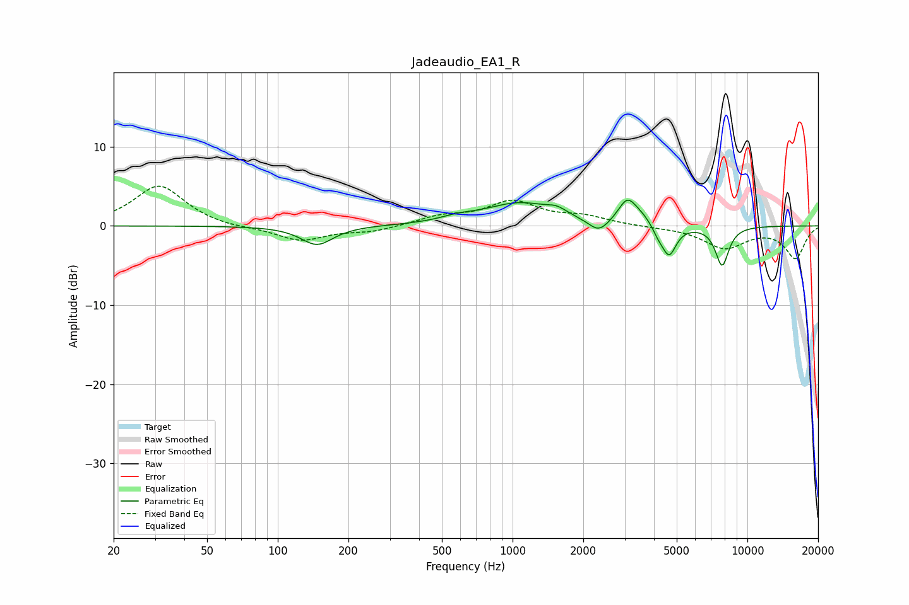

# Jadeaudio_EA1_R
See [usage instructions](https://github.com/jaakkopasanen/AutoEq#usage) for more options and info.

### Parametric EQs
Apply preamp of -3.4 dB when using parametric equalizer.

|   # | Type    |   Fc (Hz) |    Q |   Gain (dB) |
|-----|---------|-----------|------|-------------|
|   1 | Peaking |       147 | 2.07 |        -2.4 |
|   2 | Peaking |       582 | 2.04 |         0.5 |
|   3 | Peaking |      1076 | 0.93 |         2.8 |
|   4 | Peaking |      1543 | 3.49 |         0.7 |
|   5 | Peaking |      2328 | 3.23 |        -1.7 |
|   6 | Peaking |      3082 | 3.6  |         3   |
|   7 | Peaking |      3560 | 3.24 |         0.8 |
|   8 | Peaking |      4176 | 6    |        -0.9 |
|   9 | Peaking |      4639 | 4.62 |        -3.8 |
|  10 | Peaking |      7803 | 4.64 |        -5   |

### Fixed Band EQs
When using fixed band (also called graphic) equalizer, apply preamp of **-5.1 dB** (if available) and set gains manually with these parameters.

|   # | Type    |   Fc (Hz) |    Q |   Gain (dB) |
|-----|---------|-----------|------|-------------|
|   1 | Peaking |        31 | 1.41 |         5.1 |
|   2 | Peaking |        62 | 1.41 |        -0.3 |
|   3 | Peaking |       125 | 1.41 |        -1.9 |
|   4 | Peaking |       250 | 1.41 |        -0.7 |
|   5 | Peaking |       500 | 1.41 |         1.1 |
|   6 | Peaking |      1000 | 1.41 |         2.9 |
|   7 | Peaking |      2000 | 1.41 |         1   |
|   8 | Peaking |      4000 | 1.41 |        -0.1 |
|   9 | Peaking |      8000 | 1.41 |        -2.7 |
|  10 | Peaking |     16000 | 1.41 |        -4   |

### Graphs

