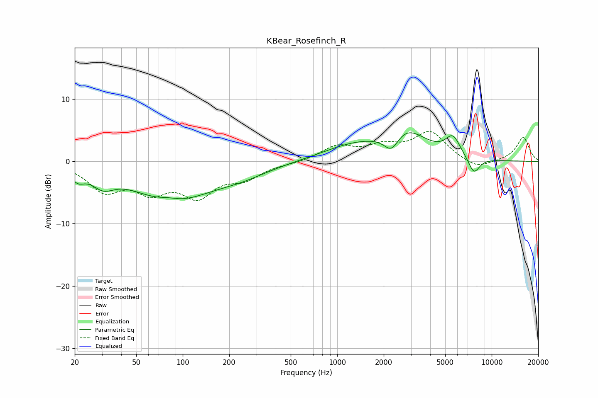

# KBear_Rosefinch_R
See [usage instructions](https://github.com/jaakkopasanen/AutoEq#usage) for more options and info.

### Parametric EQs
Apply preamp of -4.7 dB when using parametric equalizer.

|   # | Type    |   Fc (Hz) |    Q |   Gain (dB) |
|-----|---------|-----------|------|-------------|
|   1 | Peaking |        21 | 3.24 |        -1.7 |
|   2 | Peaking |        30 | 1.99 |        -2.3 |
|   3 | Peaking |        81 | 1.97 |         0.7 |
|   4 | Peaking |        84 | 0.57 |        -6.2 |
|   5 | Peaking |       240 | 0.77 |        -1.5 |
|   6 | Peaking |      1275 | 0.69 |         2.3 |
|   7 | Peaking |      2247 | 2.79 |        -3.1 |
|   8 | Peaking |      2749 | 1.05 |         4.6 |
|   9 | Peaking |      5607 | 2.85 |         3.1 |
|  10 | Peaking |      7668 | 3.56 |        -2.7 |

### Fixed Band EQs
When using fixed band (also called graphic) equalizer, apply preamp of **-4.9 dB** (if available) and set gains manually with these parameters.

|   # | Type    |   Fc (Hz) |    Q |   Gain (dB) |
|-----|---------|-----------|------|-------------|
|   1 | Peaking |        31 | 1.41 |        -4.3 |
|   2 | Peaking |        62 | 1.41 |        -4   |
|   3 | Peaking |       125 | 1.41 |        -5   |
|   4 | Peaking |       250 | 1.41 |        -2.3 |
|   5 | Peaking |       500 | 1.41 |        -0.3 |
|   6 | Peaking |      1000 | 1.41 |         2.3 |
|   7 | Peaking |      2000 | 1.41 |         2.1 |
|   8 | Peaking |      4000 | 1.41 |         4.5 |
|   9 | Peaking |      8000 | 1.41 |        -1.4 |
|  10 | Peaking |     16000 | 1.41 |         3.9 |

### Graphs

