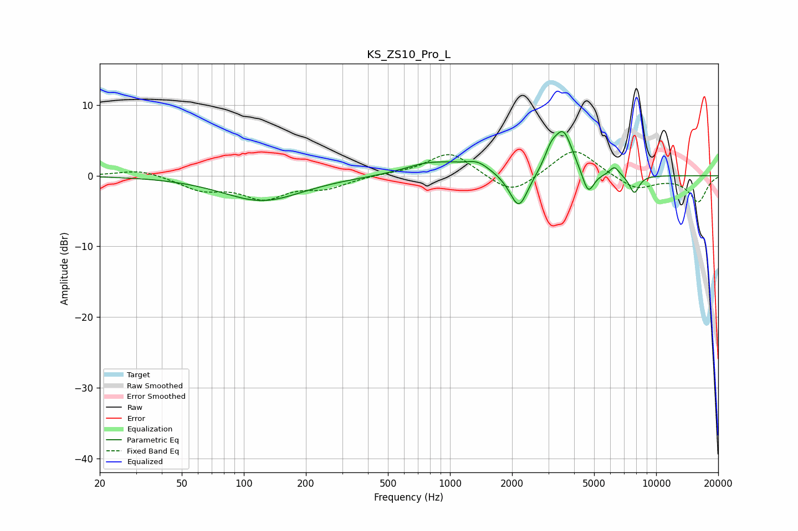

# KS_ZS10_Pro_L
See [usage instructions](https://github.com/jaakkopasanen/AutoEq#usage) for more options and info.

### Parametric EQs
Apply preamp of -6.3 dB when using parametric equalizer.

|   # | Type    |   Fc (Hz) |    Q |   Gain (dB) |
|-----|---------|-----------|------|-------------|
|   1 | Peaking |       123 | 0.73 |        -3.5 |
|   2 | Peaking |       854 | 1.14 |         2.3 |
|   3 | Peaking |       864 | 2.39 |        -0.4 |
|   4 | Peaking |      1363 | 2.42 |         1.3 |
|   5 | Peaking |      2157 | 3.21 |        -5.1 |
|   6 | Peaking |      3087 | 4.43 |         2.2 |
|   7 | Peaking |      3552 | 3.05 |         6   |
|   8 | Peaking |      4679 | 4.89 |        -3.4 |
|   9 | Peaking |      6276 | 6    |         1.3 |
|  10 | Peaking |      7837 | 5.52 |        -2.6 |

### Fixed Band EQs
When using fixed band (also called graphic) equalizer, apply preamp of **-3.5 dB** (if available) and set gains manually with these parameters.

|   # | Type    |   Fc (Hz) |    Q |   Gain (dB) |
|-----|---------|-----------|------|-------------|
|   1 | Peaking |        31 | 1.41 |         1   |
|   2 | Peaking |        62 | 1.41 |        -1.8 |
|   3 | Peaking |       125 | 1.41 |        -2.9 |
|   4 | Peaking |       250 | 1.41 |        -1.5 |
|   5 | Peaking |       500 | 1.41 |         0.2 |
|   6 | Peaking |      1000 | 1.41 |         3.4 |
|   7 | Peaking |      2000 | 1.41 |        -2.9 |
|   8 | Peaking |      4000 | 1.41 |         4.1 |
|   9 | Peaking |      8000 | 1.41 |        -2   |
|  10 | Peaking |     16000 | 1.41 |        -3.6 |

### Graphs

