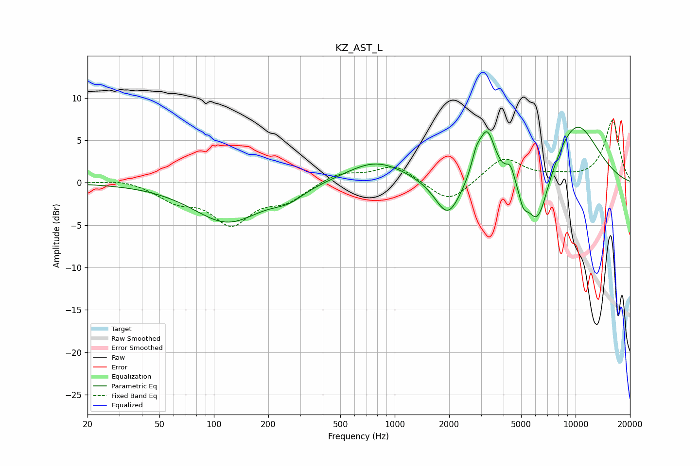

# KZ_AST_L
See [usage instructions](https://github.com/jaakkopasanen/AutoEq#usage) for more options and info.

### Parametric EQs
Apply preamp of -6.6 dB when using parametric equalizer.

|   # | Type    |   Fc (Hz) |    Q |   Gain (dB) |
|-----|---------|-----------|------|-------------|
|   1 | Peaking |       118 | 0.76 |        -4.6 |
|   2 | Peaking |       258 | 1.65 |        -1.2 |
|   3 | Peaking |       787 | 0.85 |         2.6 |
|   4 | Peaking |      1967 | 2    |        -4.6 |
|   5 | Peaking |      2820 | 5.48 |         1.9 |
|   6 | Peaking |      3238 | 3.07 |         6   |
|   7 | Peaking |      4362 | 6    |         1.7 |
|   8 | Peaking |      5138 | 5.86 |        -1.8 |
|   9 | Peaking |      6159 | 2.09 |        -7.1 |
|  10 | Peaking |     10000 | 0.88 |         7.4 |

### Fixed Band EQs
When using fixed band (also called graphic) equalizer, apply preamp of **-7.4 dB** (if available) and set gains manually with these parameters.

|   # | Type    |   Fc (Hz) |    Q |   Gain (dB) |
|-----|---------|-----------|------|-------------|
|   1 | Peaking |        31 | 1.41 |         0.5 |
|   2 | Peaking |        62 | 1.41 |        -1.9 |
|   3 | Peaking |       125 | 1.41 |        -4.5 |
|   4 | Peaking |       250 | 1.41 |        -1.9 |
|   5 | Peaking |       500 | 1.41 |         1.2 |
|   6 | Peaking |      1000 | 1.41 |         2.1 |
|   7 | Peaking |      2000 | 1.41 |        -2.6 |
|   8 | Peaking |      4000 | 1.41 |         3   |
|   9 | Peaking |      8000 | 1.41 |         0.5 |
|  10 | Peaking |     16000 | 1.41 |         7.3 |

### Graphs

