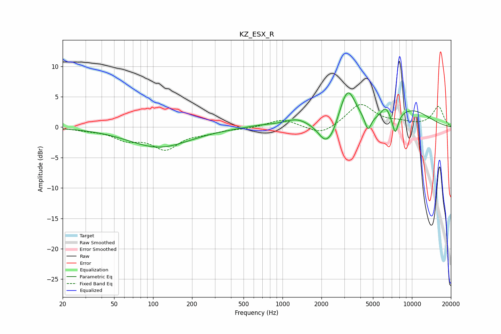

# KZ_ESX_R
See [usage instructions](https://github.com/jaakkopasanen/AutoEq#usage) for more options and info.

### Parametric EQs
Apply preamp of -5.7 dB when using parametric equalizer.

|   # | Type    |   Fc (Hz) |    Q |   Gain (dB) |
|-----|---------|-----------|------|-------------|
|   1 | Peaking |       111 | 0.6  |        -3.3 |
|   2 | Peaking |       686 | 1.15 |         0.4 |
|   3 | Peaking |      1289 | 1.52 |         1.3 |
|   4 | Peaking |      2144 | 2.51 |        -3.1 |
|   5 | Peaking |      2450 | 3.49 |        -1.3 |
|   6 | Peaking |      3191 | 2.3  |         6.1 |
|   7 | Peaking |      4574 | 5.86 |        -2.5 |
|   8 | Peaking |      6239 | 4.06 |         1.7 |
|   9 | Peaking |      7438 | 5.73 |        -3.4 |
|  10 | Peaking |      9835 | 0.75 |         2.7 |

### Fixed Band EQs
When using fixed band (also called graphic) equalizer, apply preamp of **-3.8 dB** (if available) and set gains manually with these parameters.

|   # | Type    |   Fc (Hz) |    Q |   Gain (dB) |
|-----|---------|-----------|------|-------------|
|   1 | Peaking |        31 | 1.41 |        -0.3 |
|   2 | Peaking |        62 | 1.41 |        -1.8 |
|   3 | Peaking |       125 | 1.41 |        -3.3 |
|   4 | Peaking |       250 | 1.41 |        -0.7 |
|   5 | Peaking |       500 | 1.41 |        -0.2 |
|   6 | Peaking |      1000 | 1.41 |         1.3 |
|   7 | Peaking |      2000 | 1.41 |        -1.5 |
|   8 | Peaking |      4000 | 1.41 |         3.8 |
|   9 | Peaking |      8000 | 1.41 |         0.6 |
|  10 | Peaking |     16000 | 1.41 |         3.4 |

### Graphs

