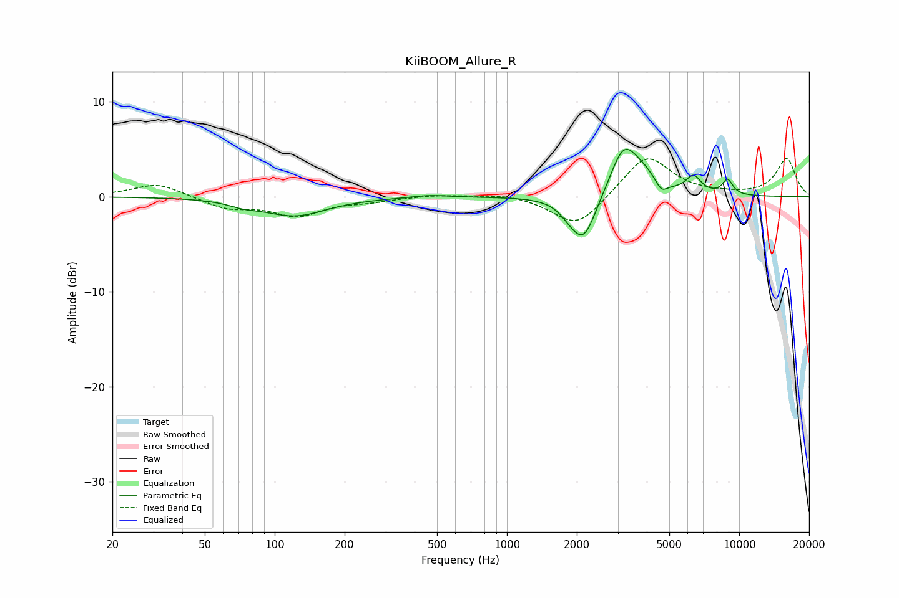

# KiiBOOM_Allure_R
See [usage instructions](https://github.com/jaakkopasanen/AutoEq#usage) for more options and info.

### Parametric EQs
Apply preamp of -5.1 dB when using parametric equalizer.

|   # | Type    |   Fc (Hz) |    Q |   Gain (dB) |
|-----|---------|-----------|------|-------------|
|   1 | Peaking |        73 | 2.37 |        -0.4 |
|   2 | Peaking |       122 | 1.03 |        -2   |
|   3 | Peaking |       465 | 1.86 |         0.3 |
|   4 | Peaking |      1848 | 3.67 |        -0.6 |
|   5 | Peaking |      2137 | 2.56 |        -4.9 |
|   6 | Peaking |      3175 | 2.4  |         4.9 |
|   7 | Peaking |      3859 | 2.05 |         1.6 |
|   8 | Peaking |      4625 | 5.55 |        -1.1 |
|   9 | Peaking |      6356 | 4.21 |         1.8 |
|  10 | Peaking |      8911 | 5.58 |         1.6 |

### Fixed Band EQs
When using fixed band (also called graphic) equalizer, apply preamp of **-4.1 dB** (if available) and set gains manually with these parameters.

|   # | Type    |   Fc (Hz) |    Q |   Gain (dB) |
|-----|---------|-----------|------|-------------|
|   1 | Peaking |        31 | 1.41 |         1.5 |
|   2 | Peaking |        62 | 1.41 |        -1.2 |
|   3 | Peaking |       125 | 1.41 |        -1.9 |
|   4 | Peaking |       250 | 1.41 |        -0.4 |
|   5 | Peaking |       500 | 1.41 |         0.2 |
|   6 | Peaking |      1000 | 1.41 |         0.4 |
|   7 | Peaking |      2000 | 1.41 |        -3.3 |
|   8 | Peaking |      4000 | 1.41 |         4.5 |
|   9 | Peaking |      8000 | 1.41 |         0.1 |
|  10 | Peaking |     16000 | 1.41 |         4   |

### Graphs

