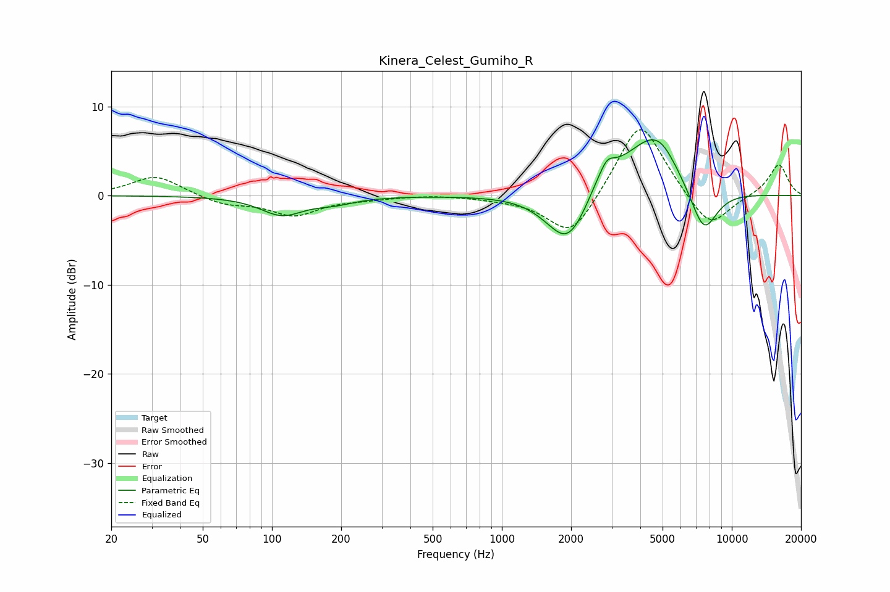

# Kinera_Celest_Gumiho_R
See [usage instructions](https://github.com/jaakkopasanen/AutoEq#usage) for more options and info.

### Parametric EQs
Apply preamp of -6.3 dB when using parametric equalizer.

|   # | Type    |   Fc (Hz) |    Q |   Gain (dB) |
|-----|---------|-----------|------|-------------|
|   1 | Peaking |       110 | 1.54 |        -2.1 |
|   2 | Peaking |       187 | 1.59 |        -0.7 |
|   3 | Peaking |      1578 | 1.64 |        -0.6 |
|   4 | Peaking |      1923 | 1.77 |        -4.8 |
|   5 | Peaking |      2326 | 1.63 |        -2.4 |
|   6 | Peaking |      2653 | 1.62 |         3.6 |
|   7 | Peaking |      2871 | 5.03 |         1.1 |
|   8 | Peaking |      4465 | 1.15 |         5.9 |
|   9 | Peaking |      4978 | 2.34 |         1.2 |
|  10 | Peaking |      7548 | 2.22 |        -5.3 |

### Fixed Band EQs
When using fixed band (also called graphic) equalizer, apply preamp of **-7.5 dB** (if available) and set gains manually with these parameters.

|   # | Type    |   Fc (Hz) |    Q |   Gain (dB) |
|-----|---------|-----------|------|-------------|
|   1 | Peaking |        31 | 1.41 |         2.3 |
|   2 | Peaking |        62 | 1.41 |        -1   |
|   3 | Peaking |       125 | 1.41 |        -2.1 |
|   4 | Peaking |       250 | 1.41 |        -0.3 |
|   5 | Peaking |       500 | 1.41 |         0.1 |
|   6 | Peaking |      1000 | 1.41 |        -0.2 |
|   7 | Peaking |      2000 | 1.41 |        -5   |
|   8 | Peaking |      4000 | 1.41 |         8.8 |
|   9 | Peaking |      8000 | 1.41 |        -4.1 |
|  10 | Peaking |     16000 | 1.41 |         3.6 |

### Graphs

