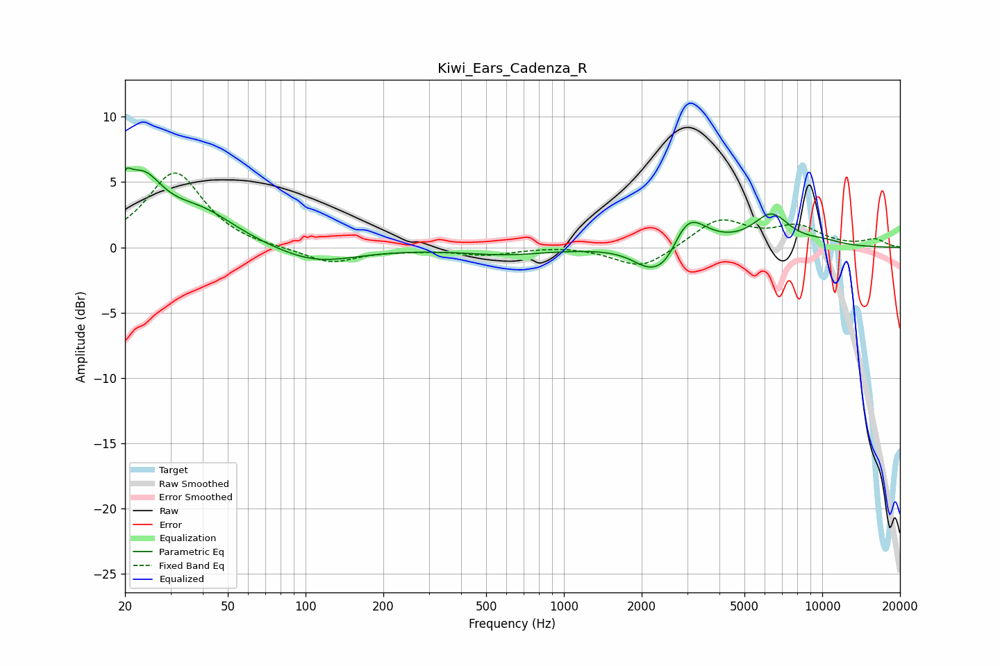

# Kiwi_Ears_Cadenza_R
See [usage instructions](https://github.com/jaakkopasanen/AutoEq#usage) for more options and info.

### Parametric EQs
Apply preamp of -6.2 dB when using parametric equalizer.

|   # | Type    |   Fc (Hz) |    Q |   Gain (dB) |
|-----|---------|-----------|------|-------------|
|   1 | Peaking |        20 | 5.88 |         1.8 |
|   2 | Peaking |        23 | 1.79 |         4.4 |
|   3 | Peaking |        39 | 1.01 |         2.4 |
|   4 | Peaking |       108 | 0.89 |        -1.3 |
|   5 | Peaking |       597 | 0.89 |        -0.5 |
|   6 | Peaking |      2129 | 2.08 |        -1.5 |
|   7 | Peaking |      2503 | 2.54 |        -1.7 |
|   8 | Peaking |      3001 | 2.04 |         2.9 |
|   9 | Peaking |      6356 | 1.92 |         2.4 |
|  10 | Peaking |     10000 | 1.66 |         0.3 |

### Fixed Band EQs
When using fixed band (also called graphic) equalizer, apply preamp of **-5.8 dB** (if available) and set gains manually with these parameters.

|   # | Type    |   Fc (Hz) |    Q |   Gain (dB) |
|-----|---------|-----------|------|-------------|
|   1 | Peaking |        31 | 1.41 |         5.8 |
|   2 | Peaking |        62 | 1.41 |        -0.1 |
|   3 | Peaking |       125 | 1.41 |        -1.2 |
|   4 | Peaking |       250 | 1.41 |        -0.1 |
|   5 | Peaking |       500 | 1.41 |        -0.5 |
|   6 | Peaking |      1000 | 1.41 |         0.2 |
|   7 | Peaking |      2000 | 1.41 |        -1.7 |
|   8 | Peaking |      4000 | 1.41 |         2.2 |
|   9 | Peaking |      8000 | 1.41 |         1.5 |
|  10 | Peaking |     16000 | 1.41 |         0.6 |

### Graphs

