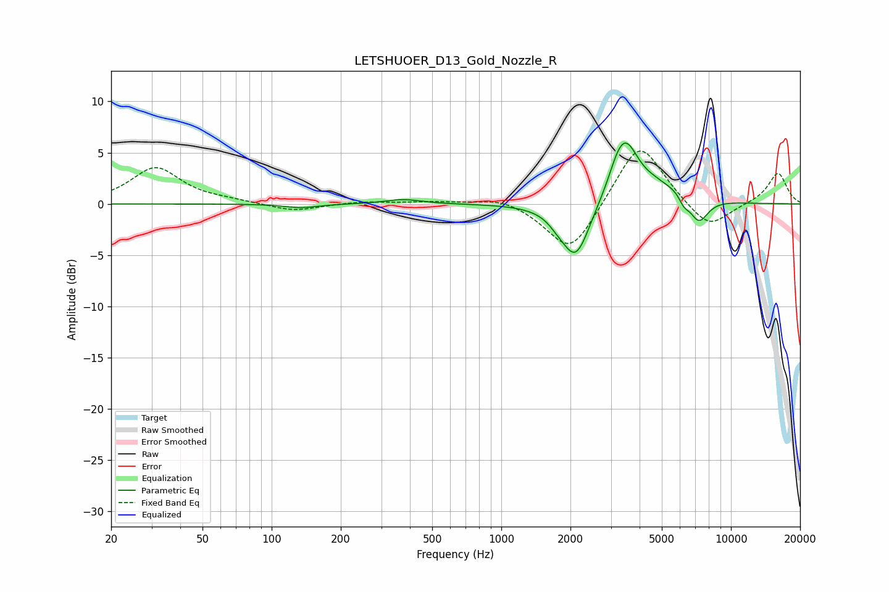

# LETSHUOER_D13_Gold_Nozzle_R
See [usage instructions](https://github.com/jaakkopasanen/AutoEq#usage) for more options and info.

### Parametric EQs
Apply preamp of -6.0 dB when using parametric equalizer.

|   # | Type    |   Fc (Hz) |    Q |   Gain (dB) |
|-----|---------|-----------|------|-------------|
|   1 | Peaking |       135 | 1.91 |        -0.4 |
|   2 | Peaking |       374 | 1.82 |         0.5 |
|   3 | Peaking |      1756 | 4.01 |        -0.5 |
|   4 | Peaking |      2109 | 2.26 |        -5.6 |
|   5 | Peaking |      3185 | 4.2  |         0.7 |
|   6 | Peaking |      3461 | 2.29 |         5.9 |
|   7 | Peaking |      4587 | 2.88 |         0.4 |
|   8 | Peaking |      5792 | 1.3  |         1.4 |
|   9 | Peaking |      6241 | 6    |        -0.9 |
|  10 | Peaking |      7230 | 3.15 |        -2.7 |

### Fixed Band EQs
When using fixed band (also called graphic) equalizer, apply preamp of **-5.3 dB** (if available) and set gains manually with these parameters.

|   # | Type    |   Fc (Hz) |    Q |   Gain (dB) |
|-----|---------|-----------|------|-------------|
|   1 | Peaking |        31 | 1.41 |         3.5 |
|   2 | Peaking |        62 | 1.41 |         0.2 |
|   3 | Peaking |       125 | 1.41 |        -0.8 |
|   4 | Peaking |       250 | 1.41 |         0.2 |
|   5 | Peaking |       500 | 1.41 |         0.2 |
|   6 | Peaking |      1000 | 1.41 |         0.7 |
|   7 | Peaking |      2000 | 1.41 |        -5   |
|   8 | Peaking |      4000 | 1.41 |         6.4 |
|   9 | Peaking |      8000 | 1.41 |        -2.6 |
|  10 | Peaking |     16000 | 1.41 |         3.1 |

### Graphs

