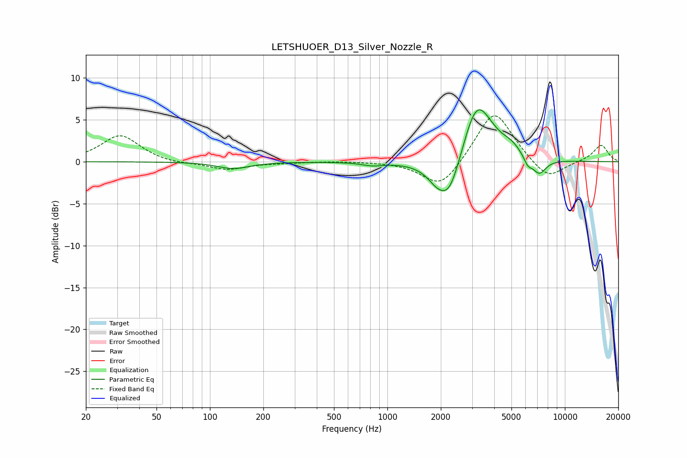

# LETSHUOER_D13_Silver_Nozzle_R
See [usage instructions](https://github.com/jaakkopasanen/AutoEq#usage) for more options and info.

### Parametric EQs
Apply preamp of -6.3 dB when using parametric equalizer.

|   # | Type    |   Fc (Hz) |    Q |   Gain (dB) |
|-----|---------|-----------|------|-------------|
|   1 | Peaking |       136 | 1.58 |        -0.8 |
|   2 | Peaking |       826 | 2.25 |        -0.4 |
|   3 | Peaking |      1872 | 3.83 |        -0.5 |
|   4 | Peaking |      1928 | 1.66 |        -1.2 |
|   5 | Peaking |      2229 | 2.13 |        -4.7 |
|   6 | Peaking |      3167 | 1.83 |         6   |
|   7 | Peaking |      3533 | 1.35 |         1.7 |
|   8 | Peaking |      5003 | 2.5  |         1   |
|   9 | Peaking |      6182 | 6    |        -1   |
|  10 | Peaking |      7159 | 3.37 |        -1.9 |

### Fixed Band EQs
When using fixed band (also called graphic) equalizer, apply preamp of **-5.6 dB** (if available) and set gains manually with these parameters.

|   # | Type    |   Fc (Hz) |    Q |   Gain (dB) |
|-----|---------|-----------|------|-------------|
|   1 | Peaking |        31 | 1.41 |         3.2 |
|   2 | Peaking |        62 | 1.41 |        -0.3 |
|   3 | Peaking |       125 | 1.41 |        -0.9 |
|   4 | Peaking |       250 | 1.41 |        -0.1 |
|   5 | Peaking |       500 | 1.41 |         0.1 |
|   6 | Peaking |      1000 | 1.41 |         0   |
|   7 | Peaking |      2000 | 1.41 |        -3.3 |
|   8 | Peaking |      4000 | 1.41 |         6.4 |
|   9 | Peaking |      8000 | 1.41 |        -2.3 |
|  10 | Peaking |     16000 | 1.41 |         2   |

### Graphs

