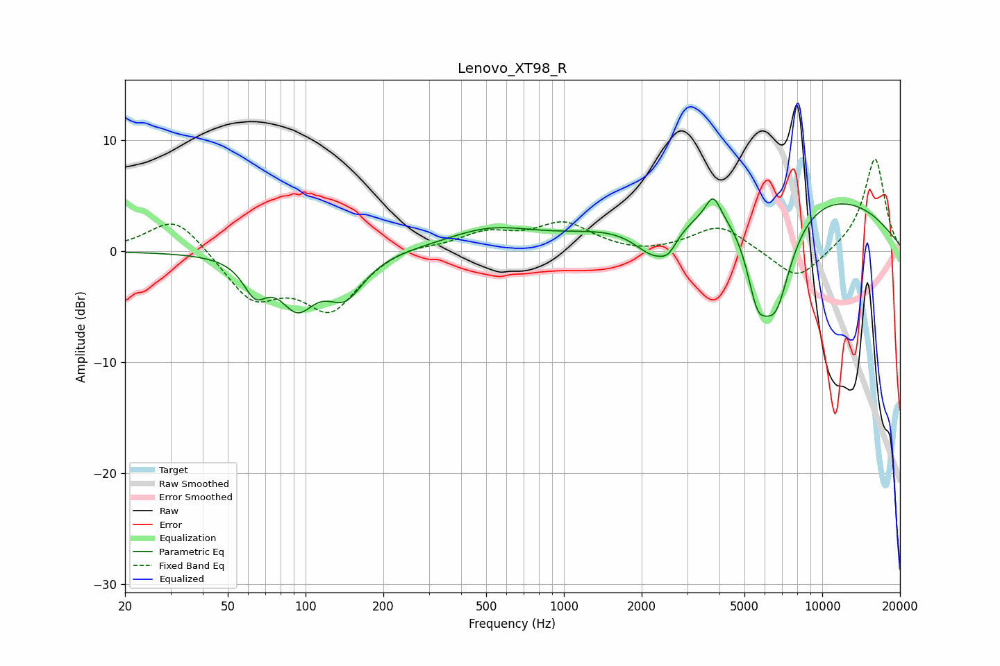

# Lenovo_XT98_R
See [usage instructions](https://github.com/jaakkopasanen/AutoEq#usage) for more options and info.

### Parametric EQs
Apply preamp of -4.8 dB when using parametric equalizer.

|   # | Type    |   Fc (Hz) |    Q |   Gain (dB) |
|-----|---------|-----------|------|-------------|
|   1 | Peaking |        64 | 3.1  |        -2.9 |
|   2 | Peaking |        93 | 2.08 |        -4.3 |
|   3 | Peaking |       142 | 1.94 |        -3.7 |
|   4 | Peaking |       514 | 0.84 |         1.8 |
|   5 | Peaking |      2267 | 1.67 |        -3.8 |
|   6 | Peaking |      2544 | 4.77 |        -0.9 |
|   7 | Peaking |      3781 | 4.93 |         2.1 |
|   8 | Peaking |      5599 | 3.37 |        -5.1 |
|   9 | Peaking |      6590 | 1.98 |        -9.4 |
|  10 | Peaking |      6807 | 0.24 |         6.1 |

### Fixed Band EQs
When using fixed band (also called graphic) equalizer, apply preamp of **-8.4 dB** (if available) and set gains manually with these parameters.

|   # | Type    |   Fc (Hz) |    Q |   Gain (dB) |
|-----|---------|-----------|------|-------------|
|   1 | Peaking |        31 | 1.41 |         3.3 |
|   2 | Peaking |        62 | 1.41 |        -4.2 |
|   3 | Peaking |       125 | 1.41 |        -5   |
|   4 | Peaking |       250 | 1.41 |         0.7 |
|   5 | Peaking |       500 | 1.41 |         1.5 |
|   6 | Peaking |      1000 | 1.41 |         2.4 |
|   7 | Peaking |      2000 | 1.41 |        -0.4 |
|   8 | Peaking |      4000 | 1.41 |         2.4 |
|   9 | Peaking |      8000 | 1.41 |        -2.8 |
|  10 | Peaking |     16000 | 1.41 |         8.5 |

### Graphs

