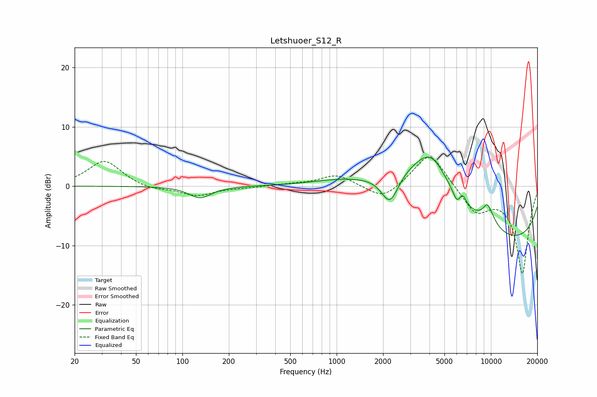

# Letshuoer_S12_R
See [usage instructions](https://github.com/jaakkopasanen/AutoEq#usage) for more options and info.

### Parametric EQs
Apply preamp of -5.0 dB when using parametric equalizer.

|   # | Type    |   Fc (Hz) |    Q |   Gain (dB) |
|-----|---------|-----------|------|-------------|
|   1 | Peaking |       130 | 1.98 |        -2   |
|   2 | Peaking |       995 | 0.79 |         0.7 |
|   3 | Peaking |      2217 | 2.47 |        -5.3 |
|   4 | Peaking |      3453 | 0.51 |         8.7 |
|   5 | Peaking |      4138 | 1.42 |         4.8 |
|   6 | Peaking |      6027 | 5.69 |        -1.6 |
|   7 | Peaking |      6555 | 6    |         1.5 |
|   8 | Peaking |      9460 | 5.98 |         0.9 |
|   9 | Peaking |      9631 | 2.5  |         2.8 |
|  10 | Peaking |     10000 | 0.19 |       -10.1 |

### Fixed Band EQs
When using fixed band (also called graphic) equalizer, apply preamp of **-5.0 dB** (if available) and set gains manually with these parameters.

|   # | Type    |   Fc (Hz) |    Q |   Gain (dB) |
|-----|---------|-----------|------|-------------|
|   1 | Peaking |        31 | 1.41 |         4.3 |
|   2 | Peaking |        62 | 1.41 |        -0.7 |
|   3 | Peaking |       125 | 1.41 |        -1.6 |
|   4 | Peaking |       250 | 1.41 |        -0.2 |
|   5 | Peaking |       500 | 1.41 |         0.3 |
|   6 | Peaking |      1000 | 1.41 |         2   |
|   7 | Peaking |      2000 | 1.41 |        -2.5 |
|   8 | Peaking |      4000 | 1.41 |         6   |
|   9 | Peaking |      8000 | 1.41 |        -4.3 |
|  10 | Peaking |     16000 | 1.41 |       -14.7 |

### Graphs

