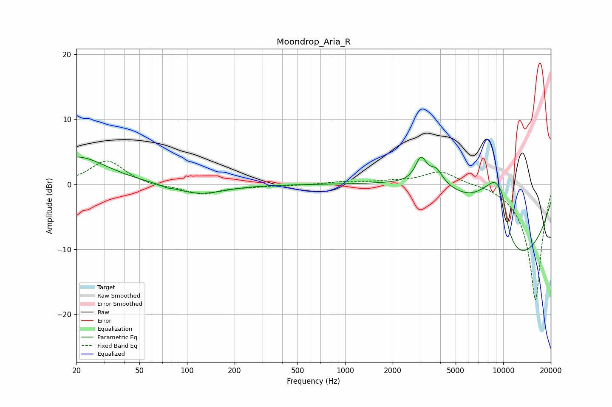

# Moondrop_Aria_R
See [usage instructions](https://github.com/jaakkopasanen/AutoEq#usage) for more options and info.

### Parametric EQs
Apply preamp of -4.3 dB when using parametric equalizer.

|   # | Type    |   Fc (Hz) |    Q |   Gain (dB) |
|-----|---------|-----------|------|-------------|
|   1 | Peaking |        20 | 0.74 |         4.3 |
|   2 | Peaking |        74 | 5.74 |        -0.2 |
|   3 | Peaking |       119 | 0.9  |        -1.6 |
|   4 | Peaking |      3020 | 4.03 |         3.7 |
|   5 | Peaking |      3776 | 3.51 |         2.1 |
|   6 | Peaking |      4748 | 0.45 |         7.3 |
|   7 | Peaking |      7834 | 1.28 |         5   |
|   8 | Peaking |      9102 | 2.11 |         6.7 |
|   9 | Peaking |      9903 | 5.93 |         2.1 |
|  10 | Peaking |     10000 | 0.33 |       -16.2 |

### Fixed Band EQs
When using fixed band (also called graphic) equalizer, apply preamp of **-3.7 dB** (if available) and set gains manually with these parameters.

|   # | Type    |   Fc (Hz) |    Q |   Gain (dB) |
|-----|---------|-----------|------|-------------|
|   1 | Peaking |        31 | 1.41 |         3.7 |
|   2 | Peaking |        62 | 1.41 |        -0.4 |
|   3 | Peaking |       125 | 1.41 |        -1.5 |
|   4 | Peaking |       250 | 1.41 |        -0.3 |
|   5 | Peaking |       500 | 1.41 |        -0.1 |
|   6 | Peaking |      1000 | 1.41 |         0.4 |
|   7 | Peaking |      2000 | 1.41 |         0.4 |
|   8 | Peaking |      4000 | 1.41 |         2.1 |
|   9 | Peaking |      8000 | 1.41 |         0.3 |
|  10 | Peaking |     16000 | 1.41 |       -18   |

### Graphs

