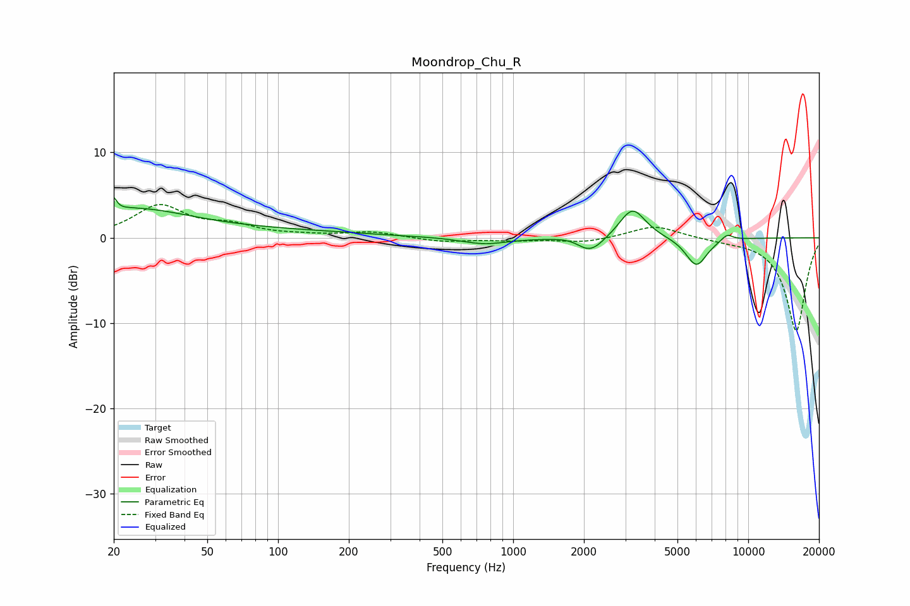

# Moondrop_Chu_R
See [usage instructions](https://github.com/jaakkopasanen/AutoEq#usage) for more options and info.

### Parametric EQs
Apply preamp of -4.8 dB when using parametric equalizer.

|   # | Type    |   Fc (Hz) |    Q |   Gain (dB) |
|-----|---------|-----------|------|-------------|
|   1 | Peaking |        20 | 5.88 |         3   |
|   2 | Peaking |        21 | 5.98 |        -1.5 |
|   3 | Peaking |        24 | 0.61 |         2.7 |
|   4 | Peaking |        66 | 0.27 |         0.9 |
|   5 | Peaking |       754 | 1.46 |        -0.8 |
|   6 | Peaking |      1796 | 2.25 |         0.5 |
|   7 | Peaking |      2117 | 2.38 |        -2.1 |
|   8 | Peaking |      3219 | 2.53 |         3.6 |
|   9 | Peaking |      6017 | 2.99 |        -3.4 |
|  10 | Peaking |      8128 | 5.27 |         0.8 |

### Fixed Band EQs
When using fixed band (also called graphic) equalizer, apply preamp of **-4.0 dB** (if available) and set gains manually with these parameters.

|   # | Type    |   Fc (Hz) |    Q |   Gain (dB) |
|-----|---------|-----------|------|-------------|
|   1 | Peaking |        31 | 1.41 |         3.6 |
|   2 | Peaking |        62 | 1.41 |         1.2 |
|   3 | Peaking |       125 | 1.41 |         0.2 |
|   4 | Peaking |       250 | 1.41 |         0.7 |
|   5 | Peaking |       500 | 1.41 |        -0.5 |
|   6 | Peaking |      1000 | 1.41 |        -0.3 |
|   7 | Peaking |      2000 | 1.41 |        -0.6 |
|   8 | Peaking |      4000 | 1.41 |         1.5 |
|   9 | Peaking |      8000 | 1.41 |        -0.2 |
|  10 | Peaking |     16000 | 1.41 |       -11   |

### Graphs

