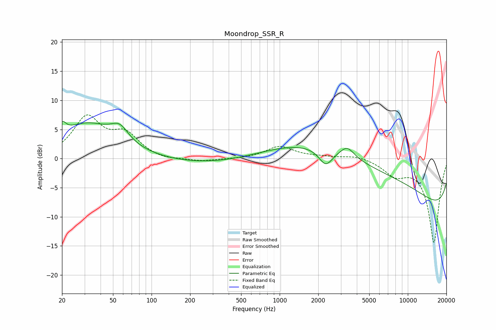

# Moondrop_SSR_R
See [usage instructions](https://github.com/jaakkopasanen/AutoEq#usage) for more options and info.

### Parametric EQs
Apply preamp of -6.5 dB when using parametric equalizer.

|   # | Type    |   Fc (Hz) |    Q |   Gain (dB) |
|-----|---------|-----------|------|-------------|
|   1 | Peaking |        20 | 5.26 |         1.9 |
|   2 | Peaking |        31 | 0.61 |         5.8 |
|   3 | Peaking |        56 | 2.1  |         2.5 |
|   4 | Peaking |       257 | 5.89 |         0   |
|   5 | Peaking |       272 | 0.39 |        -1   |
|   6 | Peaking |      2286 | 2.67 |        -2.8 |
|   7 | Peaking |      3365 | 2.65 |         1.9 |
|   8 | Peaking |      4275 | 0.19 |         4.1 |
|   9 | Peaking |      5356 | 0.23 |         6.1 |
|  10 | Peaking |     10000 | 0.18 |       -13.2 |

### Fixed Band EQs
When using fixed band (also called graphic) equalizer, apply preamp of **-7.6 dB** (if available) and set gains manually with these parameters.

|   # | Type    |   Fc (Hz) |    Q |   Gain (dB) |
|-----|---------|-----------|------|-------------|
|   1 | Peaking |        31 | 1.41 |         6.8 |
|   2 | Peaking |        62 | 1.41 |         3.7 |
|   3 | Peaking |       125 | 1.41 |        -0.4 |
|   4 | Peaking |       250 | 1.41 |        -0.5 |
|   5 | Peaking |       500 | 1.41 |        -0.1 |
|   6 | Peaking |      1000 | 1.41 |         2.1 |
|   7 | Peaking |      2000 | 1.41 |         0.2 |
|   8 | Peaking |      4000 | 1.41 |         0.6 |
|   9 | Peaking |      8000 | 1.41 |        -2.5 |
|  10 | Peaking |     16000 | 1.41 |       -14.4 |

### Graphs

