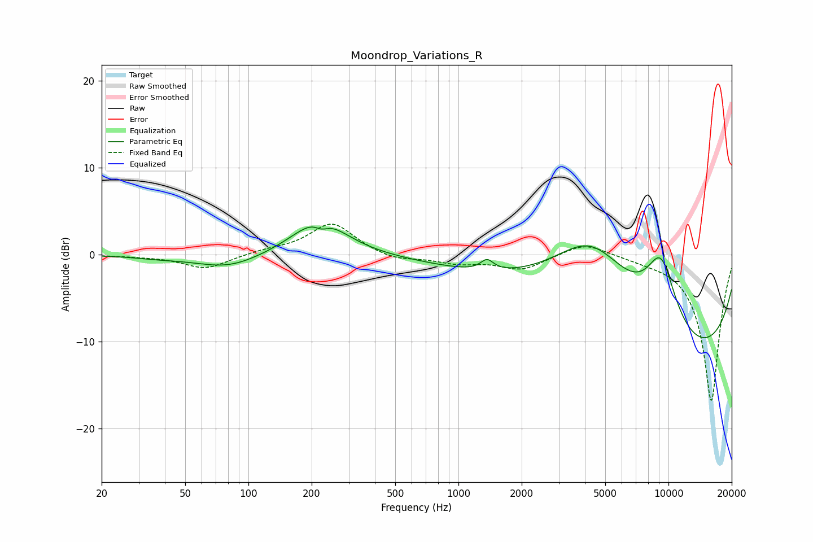

# Moondrop_Variations_R
See [usage instructions](https://github.com/jaakkopasanen/AutoEq#usage) for more options and info.

### Parametric EQs
Apply preamp of -3.3 dB when using parametric equalizer.

|   # | Type    |   Fc (Hz) |    Q |   Gain (dB) |
|-----|---------|-----------|------|-------------|
|   1 | Peaking |        38 | 1.29 |        -0.2 |
|   2 | Peaking |        80 | 0.93 |        -1.6 |
|   3 | Peaking |       218 | 1.13 |         4.3 |
|   4 | Peaking |       223 | 4.34 |        -0.9 |
|   5 | Peaking |      1331 | 4.58 |        -0.2 |
|   6 | Peaking |      1364 | 4.56 |         1.4 |
|   7 | Peaking |      4304 | 0.55 |        13.1 |
|   8 | Peaking |      4348 | 0.2  |        -0.8 |
|   9 | Peaking |      8749 | 0.18 |       -13.8 |
|  10 | Peaking |      9216 | 1.68 |         8.1 |

### Fixed Band EQs
When using fixed band (also called graphic) equalizer, apply preamp of **-3.6 dB** (if available) and set gains manually with these parameters.

|   # | Type    |   Fc (Hz) |    Q |   Gain (dB) |
|-----|---------|-----------|------|-------------|
|   1 | Peaking |        31 | 1.41 |        -0.1 |
|   2 | Peaking |        62 | 1.41 |        -1.6 |
|   3 | Peaking |       125 | 1.41 |         0.4 |
|   4 | Peaking |       250 | 1.41 |         3.7 |
|   5 | Peaking |       500 | 1.41 |        -0.7 |
|   6 | Peaking |      1000 | 1.41 |        -0.9 |
|   7 | Peaking |      2000 | 1.41 |        -1.7 |
|   8 | Peaking |      4000 | 1.41 |         1.5 |
|   9 | Peaking |      8000 | 1.41 |        -0.3 |
|  10 | Peaking |     16000 | 1.41 |       -16.9 |

### Graphs

