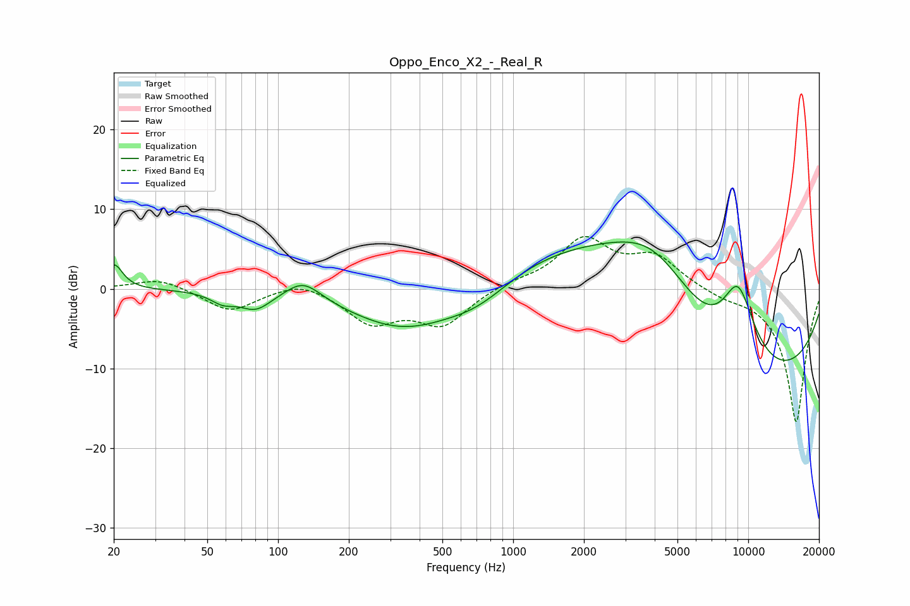

# Oppo_Enco_X2_-_Real_R
See [usage instructions](https://github.com/jaakkopasanen/AutoEq#usage) for more options and info.

### Parametric EQs
Apply preamp of -6.0 dB when using parametric equalizer.

|   # | Type    |   Fc (Hz) |    Q |   Gain (dB) |
|-----|---------|-----------|------|-------------|
|   1 | Peaking |        20 | 4.01 |         3.1 |
|   2 | Peaking |        58 | 2.81 |        -1.2 |
|   3 | Peaking |        80 | 2.1  |        -2.2 |
|   4 | Peaking |       128 | 1.84 |         2.6 |
|   5 | Peaking |       349 | 0.6  |        -5.7 |
|   6 | Peaking |       709 | 0.88 |        -3.4 |
|   7 | Peaking |      1603 | 0.31 |         6.5 |
|   8 | Peaking |      4000 | 0.48 |        14.7 |
|   9 | Peaking |      7771 | 0.27 |       -20   |
|  10 | Peaking |      9045 | 1.52 |        11.4 |

### Fixed Band EQs
When using fixed band (also called graphic) equalizer, apply preamp of **-6.7 dB** (if available) and set gains manually with these parameters.

|   # | Type    |   Fc (Hz) |    Q |   Gain (dB) |
|-----|---------|-----------|------|-------------|
|   1 | Peaking |        31 | 1.41 |         1.4 |
|   2 | Peaking |        62 | 1.41 |        -2.9 |
|   3 | Peaking |       125 | 1.41 |         1.3 |
|   4 | Peaking |       250 | 1.41 |        -4.1 |
|   5 | Peaking |       500 | 1.41 |        -4.3 |
|   6 | Peaking |      1000 | 1.41 |         0.7 |
|   7 | Peaking |      2000 | 1.41 |         6   |
|   8 | Peaking |      4000 | 1.41 |         3.8 |
|   9 | Peaking |      8000 | 1.41 |        -0.8 |
|  10 | Peaking |     16000 | 1.41 |       -16.8 |

### Graphs

