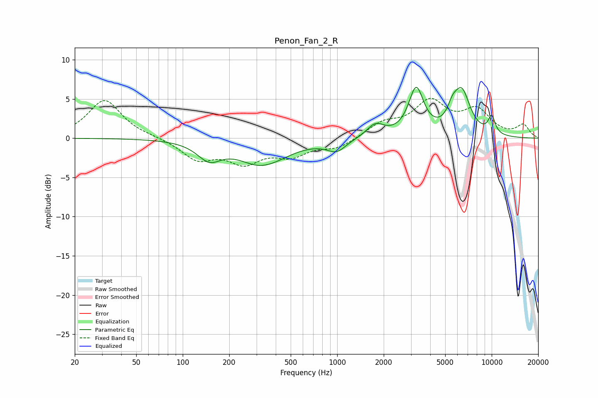

# Penon_Fan_2_R
See [usage instructions](https://github.com/jaakkopasanen/AutoEq#usage) for more options and info.

### Parametric EQs
Apply preamp of -6.6 dB when using parametric equalizer.

|   # | Type    |   Fc (Hz) |    Q |   Gain (dB) |
|-----|---------|-----------|------|-------------|
|   1 | Peaking |       148 | 1.85 |        -2.2 |
|   2 | Peaking |       334 | 0.99 |        -3.8 |
|   3 | Peaking |       351 | 1.58 |         0.6 |
|   4 | Peaking |       915 | 1.55 |        -0.3 |
|   5 | Peaking |       998 | 2.52 |        -1.2 |
|   6 | Peaking |      1766 | 2.53 |         1.7 |
|   7 | Peaking |      3243 | 2.92 |         6   |
|   8 | Peaking |      5568 | 4.32 |         1.6 |
|   9 | Peaking |      6405 | 2.47 |         5.5 |
|  10 | Peaking |     10000 | 5.26 |         2.3 |

### Fixed Band EQs
When using fixed band (also called graphic) equalizer, apply preamp of **-5.2 dB** (if available) and set gains manually with these parameters.

|   # | Type    |   Fc (Hz) |    Q |   Gain (dB) |
|-----|---------|-----------|------|-------------|
|   1 | Peaking |        31 | 1.41 |         4.9 |
|   2 | Peaking |        62 | 1.41 |         0.1 |
|   3 | Peaking |       125 | 1.41 |        -2.5 |
|   4 | Peaking |       250 | 1.41 |        -2.8 |
|   5 | Peaking |       500 | 1.41 |        -1.9 |
|   6 | Peaking |      1000 | 1.41 |        -1.2 |
|   7 | Peaking |      2000 | 1.41 |         1.7 |
|   8 | Peaking |      4000 | 1.41 |         4.4 |
|   9 | Peaking |      8000 | 1.41 |         3.3 |
|  10 | Peaking |     16000 | 1.41 |         1.6 |

### Graphs

