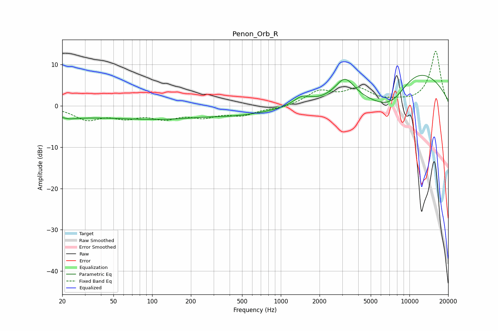

# Penon_Orb_R
See [usage instructions](https://github.com/jaakkopasanen/AutoEq#usage) for more options and info.

### Parametric EQs
Apply preamp of -7.5 dB when using parametric equalizer.

|   # | Type    |   Fc (Hz) |    Q |   Gain (dB) |
|-----|---------|-----------|------|-------------|
|   1 | Peaking |        21 | 0.76 |        -1.6 |
|   2 | Peaking |        22 | 3.36 |        -0.4 |
|   3 | Peaking |       109 | 0.48 |        -0.2 |
|   4 | Peaking |       165 | 0.19 |        -3.2 |
|   5 | Peaking |       247 | 0.97 |         0.4 |
|   6 | Peaking |      1457 | 2.17 |         2   |
|   7 | Peaking |      3151 | 1.85 |         5.3 |
|   8 | Peaking |      4991 | 0.29 |         0.4 |
|   9 | Peaking |      7199 | 0.67 |       -10.7 |
|  10 | Peaking |     10000 | 0.4  |        13.1 |

### Fixed Band EQs
When using fixed band (also called graphic) equalizer, apply preamp of **-13.3 dB** (if available) and set gains manually with these parameters.

|   # | Type    |   Fc (Hz) |    Q |   Gain (dB) |
|-----|---------|-----------|------|-------------|
|   1 | Peaking |        31 | 1.41 |        -3.1 |
|   2 | Peaking |        62 | 1.41 |        -2.3 |
|   3 | Peaking |       125 | 1.41 |        -2.5 |
|   4 | Peaking |       250 | 1.41 |        -2.2 |
|   5 | Peaking |       500 | 1.41 |        -2   |
|   6 | Peaking |      1000 | 1.41 |        -0.6 |
|   7 | Peaking |      2000 | 1.41 |         3.3 |
|   8 | Peaking |      4000 | 1.41 |         3.6 |
|   9 | Peaking |      8000 | 1.41 |         0.6 |
|  10 | Peaking |     16000 | 1.41 |        13.3 |

### Graphs

