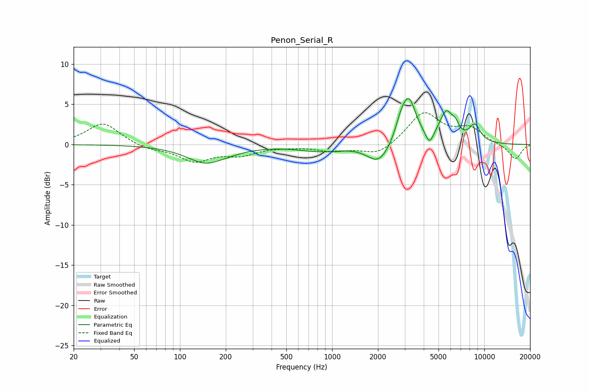

# Penon_Serial_R
See [usage instructions](https://github.com/jaakkopasanen/AutoEq#usage) for more options and info.

### Parametric EQs
Apply preamp of -5.8 dB when using parametric equalizer.

|   # | Type    |   Fc (Hz) |    Q |   Gain (dB) |
|-----|---------|-----------|------|-------------|
|   1 | Peaking |       154 | 1.09 |        -2.5 |
|   2 | Peaking |       172 | 2.12 |         0.3 |
|   3 | Peaking |       835 | 0.99 |        -0.8 |
|   4 | Peaking |      2023 | 1.92 |        -2.5 |
|   5 | Peaking |      2799 | 4.65 |         1.3 |
|   6 | Peaking |      3179 | 2.82 |         5.7 |
|   7 | Peaking |      4360 | 5.51 |        -1.6 |
|   8 | Peaking |      5623 | 3.11 |         3.6 |
|   9 | Peaking |      6478 | 6    |         1.1 |
|  10 | Peaking |      8666 | 3.37 |         2.1 |

### Fixed Band EQs
When using fixed band (also called graphic) equalizer, apply preamp of **-4.0 dB** (if available) and set gains manually with these parameters.

|   # | Type    |   Fc (Hz) |    Q |   Gain (dB) |
|-----|---------|-----------|------|-------------|
|   1 | Peaking |        31 | 1.41 |         2.7 |
|   2 | Peaking |        62 | 1.41 |        -0.6 |
|   3 | Peaking |       125 | 1.41 |        -2   |
|   4 | Peaking |       250 | 1.41 |        -1.1 |
|   5 | Peaking |       500 | 1.41 |        -0.2 |
|   6 | Peaking |      1000 | 1.41 |        -0.7 |
|   7 | Peaking |      2000 | 1.41 |        -1.4 |
|   8 | Peaking |      4000 | 1.41 |         3.9 |
|   9 | Peaking |      8000 | 1.41 |         1.9 |
|  10 | Peaking |     16000 | 1.41 |        -1.9 |

### Graphs

