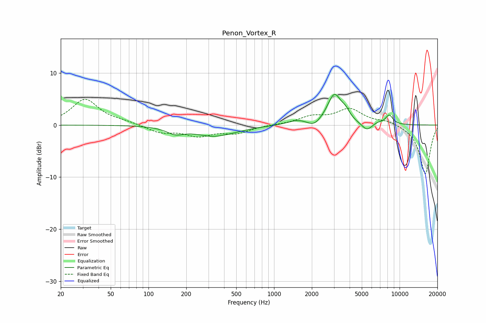

# Penon_Vortex_R
See [usage instructions](https://github.com/jaakkopasanen/AutoEq#usage) for more options and info.

### Parametric EQs
Apply preamp of -6.0 dB when using parametric equalizer.

|   # | Type    |   Fc (Hz) |    Q |   Gain (dB) |
|-----|---------|-----------|------|-------------|
|   1 | Peaking |       164 | 2.09 |        -1.2 |
|   2 | Peaking |       348 | 0.9  |        -2.3 |
|   3 | Peaking |       391 | 1.82 |         0.2 |
|   4 | Peaking |      1552 | 1.75 |         0.9 |
|   5 | Peaking |      2079 | 2.72 |        -1.2 |
|   6 | Peaking |      3023 | 2.51 |         5.8 |
|   7 | Peaking |      3726 | 4.25 |         1.3 |
|   8 | Peaking |      5479 | 3.35 |        -1.5 |
|   9 | Peaking |      6723 | 4.01 |         0.4 |
|  10 | Peaking |      8263 | 4.32 |         1.8 |

### Fixed Band EQs
When using fixed band (also called graphic) equalizer, apply preamp of **-5.0 dB** (if available) and set gains manually with these parameters.

|   # | Type    |   Fc (Hz) |    Q |   Gain (dB) |
|-----|---------|-----------|------|-------------|
|   1 | Peaking |        31 | 1.41 |         4.9 |
|   2 | Peaking |        62 | 1.41 |         0.5 |
|   3 | Peaking |       125 | 1.41 |        -1.4 |
|   4 | Peaking |       250 | 1.41 |        -1.9 |
|   5 | Peaking |       500 | 1.41 |        -1.4 |
|   6 | Peaking |      1000 | 1.41 |         0   |
|   7 | Peaking |      2000 | 1.41 |         1.5 |
|   8 | Peaking |      4000 | 1.41 |         3   |
|   9 | Peaking |      8000 | 1.41 |         0.8 |
|  10 | Peaking |     16000 | 1.41 |        -9.5 |

### Graphs

