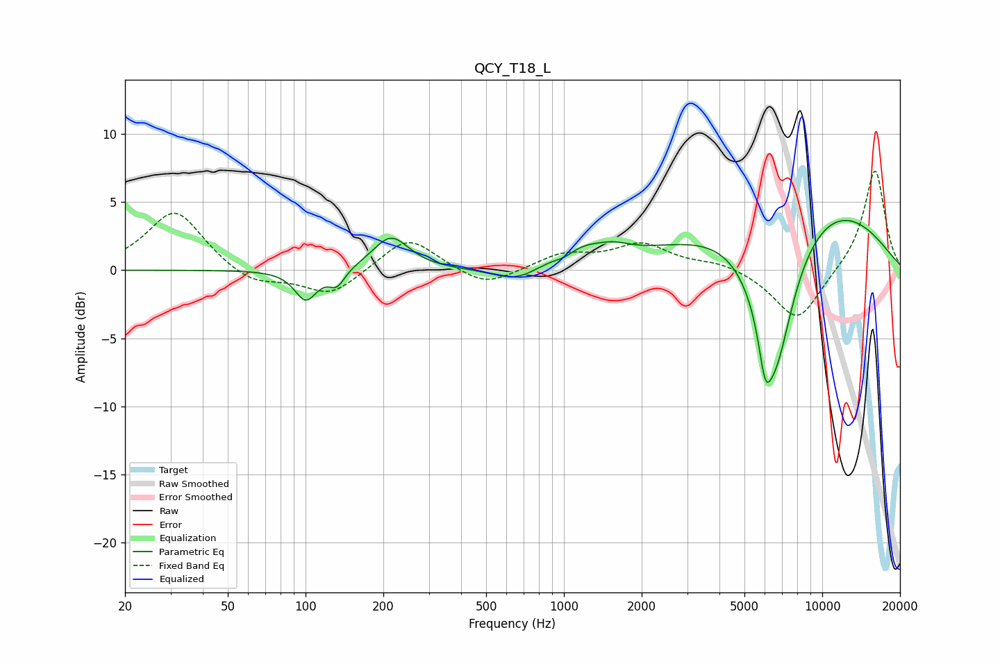

# QCY_T18_L
See [usage instructions](https://github.com/jaakkopasanen/AutoEq#usage) for more options and info.

### Parametric EQs
Apply preamp of -3.7 dB when using parametric equalizer.

|   # | Type    |   Fc (Hz) |    Q |   Gain (dB) |
|-----|---------|-----------|------|-------------|
|   1 | Peaking |       100 | 3.29 |        -2.2 |
|   2 | Peaking |       132 | 4.57 |        -1.2 |
|   3 | Peaking |       214 | 2.03 |         2.5 |
|   4 | Peaking |       660 | 1.5  |        -1.2 |
|   5 | Peaking |      1007 | 3.47 |        -0.5 |
|   6 | Peaking |      1132 | 1.25 |         1.4 |
|   7 | Peaking |      1569 | 2.33 |         0.5 |
|   8 | Peaking |      6012 | 5.71 |        -3   |
|   9 | Peaking |      6546 | 1.58 |       -12.1 |
|  10 | Peaking |      8116 | 0.36 |         6.2 |

### Fixed Band EQs
When using fixed band (also called graphic) equalizer, apply preamp of **-7.4 dB** (if available) and set gains manually with these parameters.

|   # | Type    |   Fc (Hz) |    Q |   Gain (dB) |
|-----|---------|-----------|------|-------------|
|   1 | Peaking |        31 | 1.41 |         4.4 |
|   2 | Peaking |        62 | 1.41 |        -1.2 |
|   3 | Peaking |       125 | 1.41 |        -1.9 |
|   4 | Peaking |       250 | 1.41 |         2.6 |
|   5 | Peaking |       500 | 1.41 |        -1.3 |
|   6 | Peaking |      1000 | 1.41 |         1.1 |
|   7 | Peaking |      2000 | 1.41 |         1.8 |
|   8 | Peaking |      4000 | 1.41 |         0.6 |
|   9 | Peaking |      8000 | 1.41 |        -3.8 |
|  10 | Peaking |     16000 | 1.41 |         7.5 |

### Graphs

