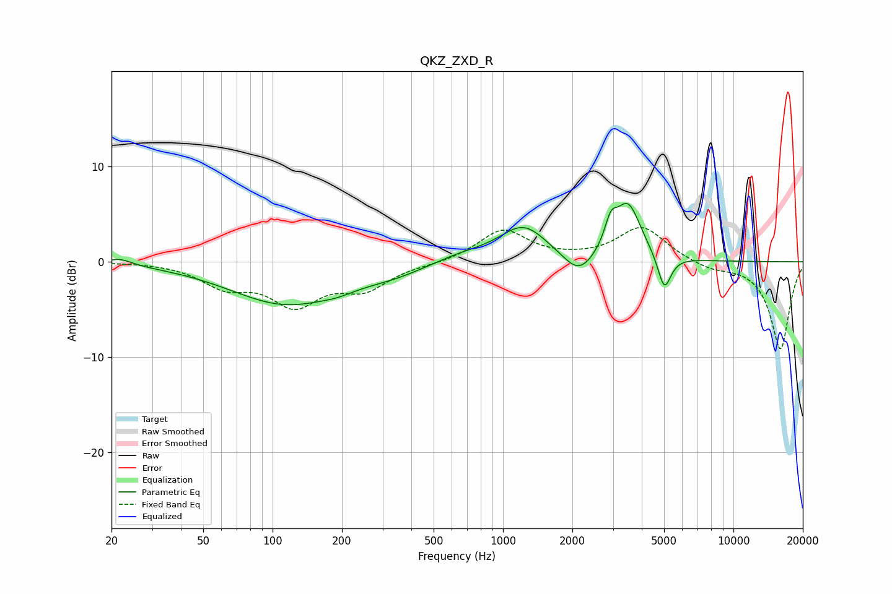

# QKZ_ZXD_R
See [usage instructions](https://github.com/jaakkopasanen/AutoEq#usage) for more options and info.

### Parametric EQs
Apply preamp of -6.2 dB when using parametric equalizer.

|   # | Type    |   Fc (Hz) |    Q |   Gain (dB) |
|-----|---------|-----------|------|-------------|
|   1 | Peaking |        22 | 2.72 |         0.7 |
|   2 | Peaking |       114 | 0.59 |        -4.3 |
|   3 | Peaking |       192 | 1.84 |        -0.4 |
|   4 | Peaking |       338 | 0.98 |        -0.9 |
|   5 | Peaking |       664 | 1.06 |         0.8 |
|   6 | Peaking |      1228 | 1.35 |         3.7 |
|   7 | Peaking |      2134 | 2.12 |        -2.4 |
|   8 | Peaking |      2935 | 5.31 |         2.5 |
|   9 | Peaking |      3486 | 2.47 |         5.9 |
|  10 | Peaking |      5015 | 4.89 |        -3.7 |

### Fixed Band EQs
When using fixed band (also called graphic) equalizer, apply preamp of **-3.7 dB** (if available) and set gains manually with these parameters.

|   # | Type    |   Fc (Hz) |    Q |   Gain (dB) |
|-----|---------|-----------|------|-------------|
|   1 | Peaking |        31 | 1.41 |         0   |
|   2 | Peaking |        62 | 1.41 |        -2.3 |
|   3 | Peaking |       125 | 1.41 |        -4.2 |
|   4 | Peaking |       250 | 1.41 |        -2.5 |
|   5 | Peaking |       500 | 1.41 |        -0.2 |
|   6 | Peaking |      1000 | 1.41 |         3.3 |
|   7 | Peaking |      2000 | 1.41 |         0.1 |
|   8 | Peaking |      4000 | 1.41 |         3.7 |
|   9 | Peaking |      8000 | 1.41 |        -0.7 |
|  10 | Peaking |     16000 | 1.41 |        -9.2 |

### Graphs

