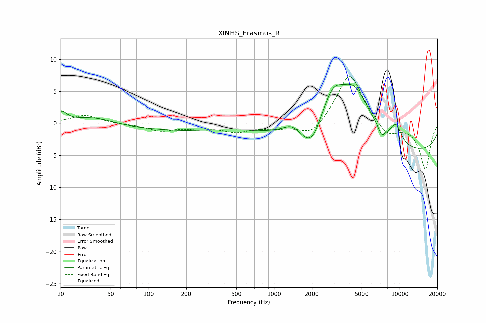

# XINHS_Erasmus_R
See [usage instructions](https://github.com/jaakkopasanen/AutoEq#usage) for more options and info.

### Parametric EQs
Apply preamp of -6.2 dB when using parametric equalizer.

|   # | Type    |   Fc (Hz) |    Q |   Gain (dB) |
|-----|---------|-----------|------|-------------|
|   1 | Peaking |        20 | 3.63 |         1.5 |
|   2 | Peaking |        36 | 0.88 |         1.2 |
|   3 | Peaking |       259 | 0.18 |        -1.2 |
|   4 | Peaking |      1373 | 2.4  |         1.1 |
|   5 | Peaking |      1978 | 1.94 |        -3.5 |
|   6 | Peaking |      2927 | 1.61 |         5.2 |
|   7 | Peaking |      4397 | 1.07 |         8.2 |
|   8 | Peaking |      7217 | 5.32 |        -1.3 |
|   9 | Peaking |      9370 | 2.88 |         2.9 |
|  10 | Peaking |     10000 | 0.18 |        -4.7 |

### Fixed Band EQs
When using fixed band (also called graphic) equalizer, apply preamp of **-7.4 dB** (if available) and set gains manually with these parameters.

|   # | Type    |   Fc (Hz) |    Q |   Gain (dB) |
|-----|---------|-----------|------|-------------|
|   1 | Peaking |        31 | 1.41 |         1.3 |
|   2 | Peaking |        62 | 1.41 |        -0.1 |
|   3 | Peaking |       125 | 1.41 |        -1.1 |
|   4 | Peaking |       250 | 1.41 |        -0.6 |
|   5 | Peaking |       500 | 1.41 |        -1.2 |
|   6 | Peaking |      1000 | 1.41 |        -0.6 |
|   7 | Peaking |      2000 | 1.41 |        -2.2 |
|   8 | Peaking |      4000 | 1.41 |         8.1 |
|   9 | Peaking |      8000 | 1.41 |        -2.2 |
|  10 | Peaking |     16000 | 1.41 |        -7.1 |

### Graphs

