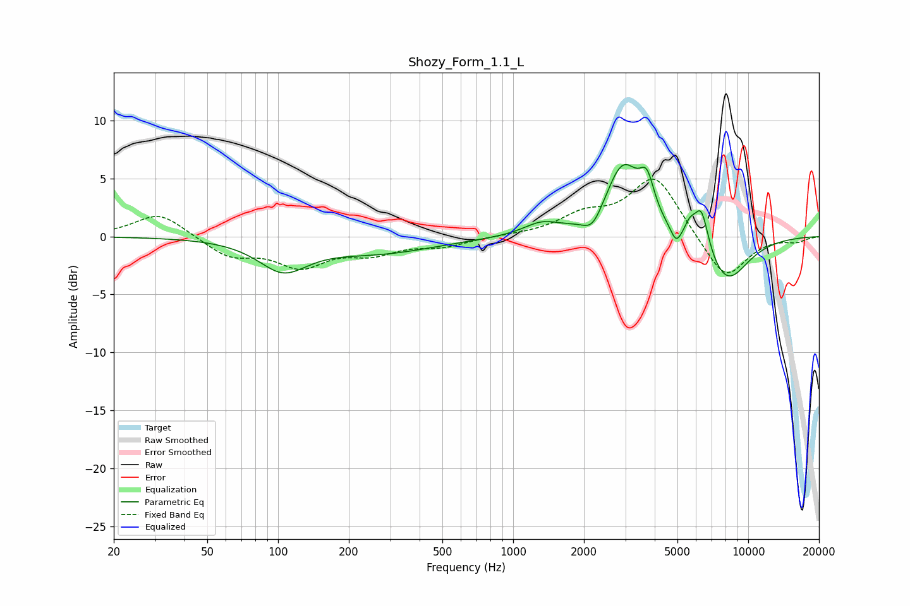

# Shozy_Form_1.1_L
See [usage instructions](https://github.com/jaakkopasanen/AutoEq#usage) for more options and info.

### Parametric EQs
Apply preamp of -6.3 dB when using parametric equalizer.

|   # | Type    |   Fc (Hz) |    Q |   Gain (dB) |
|-----|---------|-----------|------|-------------|
|   1 | Peaking |       105 | 1.37 |        -2.6 |
|   2 | Peaking |       270 | 0.58 |        -1.3 |
|   3 | Peaking |      1319 | 1.84 |         1   |
|   4 | Peaking |      2179 | 3.32 |        -1.6 |
|   5 | Peaking |      2933 | 1.86 |         6.1 |
|   6 | Peaking |      3709 | 4.53 |         2.9 |
|   7 | Peaking |      4937 | 6    |        -1.3 |
|   8 | Peaking |      5643 | 5.99 |         1.2 |
|   9 | Peaking |      6318 | 4.4  |         3.7 |
|  10 | Peaking |      8062 | 1.38 |        -4.1 |

### Fixed Band EQs
When using fixed band (also called graphic) equalizer, apply preamp of **-5.0 dB** (if available) and set gains manually with these parameters.

|   # | Type    |   Fc (Hz) |    Q |   Gain (dB) |
|-----|---------|-----------|------|-------------|
|   1 | Peaking |        31 | 1.41 |         2.1 |
|   2 | Peaking |        62 | 1.41 |        -1.7 |
|   3 | Peaking |       125 | 1.41 |        -2.4 |
|   4 | Peaking |       250 | 1.41 |        -1.2 |
|   5 | Peaking |       500 | 1.41 |        -0.8 |
|   6 | Peaking |      1000 | 1.41 |         0   |
|   7 | Peaking |      2000 | 1.41 |         1.6 |
|   8 | Peaking |      4000 | 1.41 |         5.2 |
|   9 | Peaking |      8000 | 1.41 |        -3.9 |
|  10 | Peaking |     16000 | 1.41 |        -0.4 |

### Graphs

