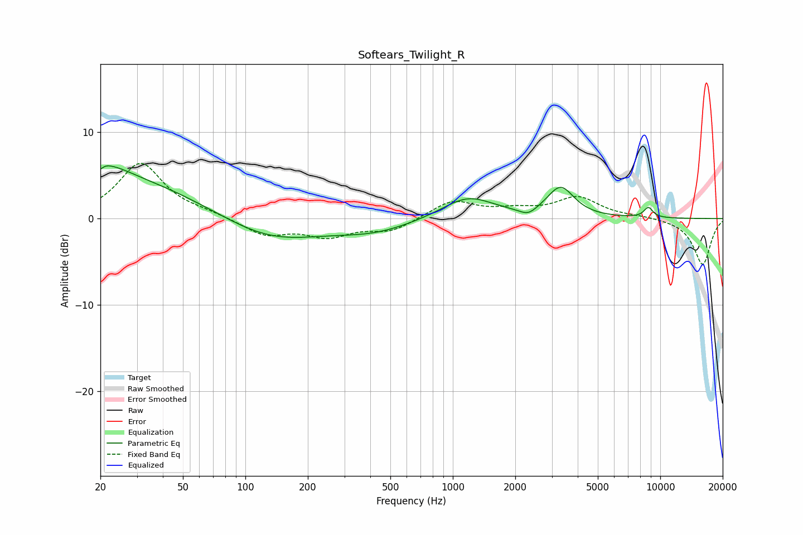

# Softears_Twilight_R
See [usage instructions](https://github.com/jaakkopasanen/AutoEq#usage) for more options and info.

### Parametric EQs
Apply preamp of -6.2 dB when using parametric equalizer.

|   # | Type    |   Fc (Hz) |    Q |   Gain (dB) |
|-----|---------|-----------|------|-------------|
|   1 | Peaking |        20 | 5.99 |        -3.6 |
|   2 | Peaking |        20 | 5.78 |         3.3 |
|   3 | Peaking |        21 | 1.29 |         1.8 |
|   4 | Peaking |        24 | 0.35 |         4.5 |
|   5 | Peaking |       131 | 0.59 |        -2.8 |
|   6 | Peaking |       419 | 0.76 |        -1.3 |
|   7 | Peaking |      1181 | 1.12 |         2.6 |
|   8 | Peaking |      2308 | 3.42 |        -0.8 |
|   9 | Peaking |      3309 | 2.19 |         3.5 |
|  10 | Peaking |      8767 | 5.79 |         1.2 |

### Fixed Band EQs
When using fixed band (also called graphic) equalizer, apply preamp of **-6.5 dB** (if available) and set gains manually with these parameters.

|   # | Type    |   Fc (Hz) |    Q |   Gain (dB) |
|-----|---------|-----------|------|-------------|
|   1 | Peaking |        31 | 1.41 |         6.4 |
|   2 | Peaking |        62 | 1.41 |         0.5 |
|   3 | Peaking |       125 | 1.41 |        -1.9 |
|   4 | Peaking |       250 | 1.41 |        -1.9 |
|   5 | Peaking |       500 | 1.41 |        -1.4 |
|   6 | Peaking |      1000 | 1.41 |         2.1 |
|   7 | Peaking |      2000 | 1.41 |         0.8 |
|   8 | Peaking |      4000 | 1.41 |         2.4 |
|   9 | Peaking |      8000 | 1.41 |         0.2 |
|  10 | Peaking |     16000 | 1.41 |        -5.3 |

### Graphs

