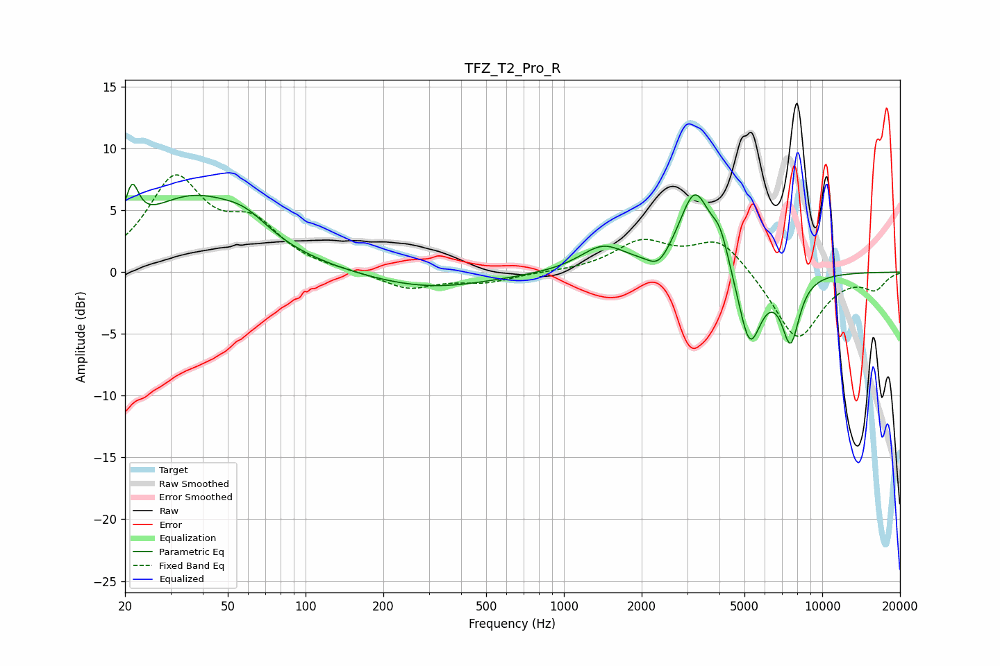

# TFZ_T2_Pro_R
See [usage instructions](https://github.com/jaakkopasanen/AutoEq#usage) for more options and info.

### Parametric EQs
Apply preamp of -7.2 dB when using parametric equalizer.

|   # | Type    |   Fc (Hz) |    Q |   Gain (dB) |
|-----|---------|-----------|------|-------------|
|   1 | Peaking |        21 | 5.52 |         3.3 |
|   2 | Peaking |        36 | 0.66 |         5.8 |
|   3 | Peaking |        59 | 1.55 |         1.4 |
|   4 | Peaking |       297 | 0.59 |        -1.3 |
|   5 | Peaking |      1414 | 1.6  |         2   |
|   6 | Peaking |      2329 | 3.37 |        -1.3 |
|   7 | Peaking |      3213 | 2.3  |         6.4 |
|   8 | Peaking |      4026 | 3.99 |         2.3 |
|   9 | Peaking |      5235 | 3.02 |        -6.2 |
|  10 | Peaking |      7540 | 3.83 |        -5.3 |

### Fixed Band EQs
When using fixed band (also called graphic) equalizer, apply preamp of **-8.0 dB** (if available) and set gains manually with these parameters.

|   # | Type    |   Fc (Hz) |    Q |   Gain (dB) |
|-----|---------|-----------|------|-------------|
|   1 | Peaking |        31 | 1.41 |         7.2 |
|   2 | Peaking |        62 | 1.41 |         3.4 |
|   3 | Peaking |       125 | 1.41 |         0   |
|   4 | Peaking |       250 | 1.41 |        -1.4 |
|   5 | Peaking |       500 | 1.41 |        -0.8 |
|   6 | Peaking |      1000 | 1.41 |        -0   |
|   7 | Peaking |      2000 | 1.41 |         2.4 |
|   8 | Peaking |      4000 | 1.41 |         2.8 |
|   9 | Peaking |      8000 | 1.41 |        -5.6 |
|  10 | Peaking |     16000 | 1.41 |        -1.3 |

### Graphs

