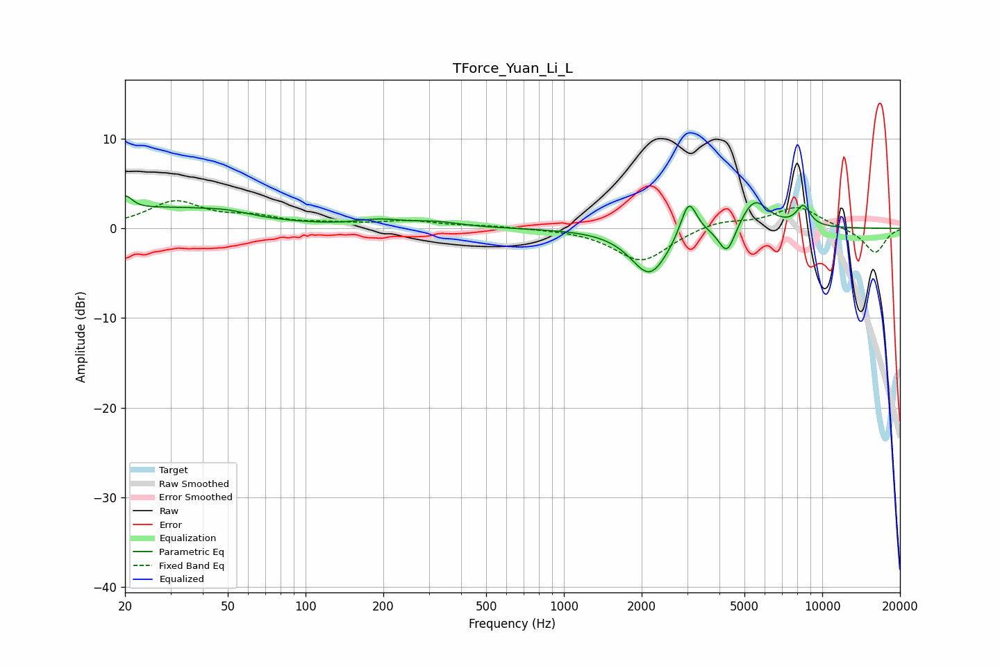

# TForce_Yuan_Li_L
See [usage instructions](https://github.com/jaakkopasanen/AutoEq#usage) for more options and info.

### Parametric EQs
Apply preamp of -3.7 dB when using parametric equalizer.

|   # | Type    |   Fc (Hz) |    Q |   Gain (dB) |
|-----|---------|-----------|------|-------------|
|   1 | Peaking |        20 | 5.11 |         1.7 |
|   2 | Peaking |        29 | 0.52 |         2.2 |
|   3 | Peaking |        50 | 1.73 |         0.4 |
|   4 | Peaking |       193 | 1.61 |         0.7 |
|   5 | Peaking |       320 | 1.47 |         0.6 |
|   6 | Peaking |      2150 | 1.93 |        -5.2 |
|   7 | Peaking |      3042 | 4.48 |         4.3 |
|   8 | Peaking |      4284 | 4.35 |        -3.3 |
|   9 | Peaking |      5463 | 2.5  |         3.4 |
|  10 | Peaking |      8450 | 4.73 |         2.3 |

### Fixed Band EQs
When using fixed band (also called graphic) equalizer, apply preamp of **-3.2 dB** (if available) and set gains manually with these parameters.

|   # | Type    |   Fc (Hz) |    Q |   Gain (dB) |
|-----|---------|-----------|------|-------------|
|   1 | Peaking |        31 | 1.41 |         2.9 |
|   2 | Peaking |        62 | 1.41 |         1   |
|   3 | Peaking |       125 | 1.41 |         0.4 |
|   4 | Peaking |       250 | 1.41 |         0.8 |
|   5 | Peaking |       500 | 1.41 |         0.3 |
|   6 | Peaking |      1000 | 1.41 |         0   |
|   7 | Peaking |      2000 | 1.41 |        -3.7 |
|   8 | Peaking |      4000 | 1.41 |         0.9 |
|   9 | Peaking |      8000 | 1.41 |         2.4 |
|  10 | Peaking |     16000 | 1.41 |        -2.8 |

### Graphs

