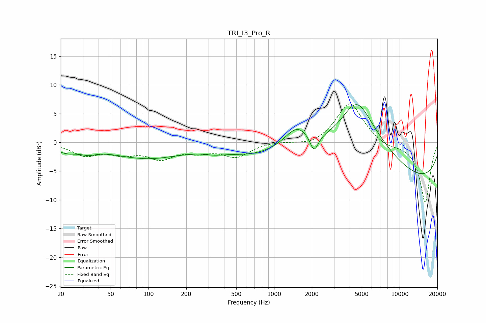

# TRI_I3_Pro_R
See [usage instructions](https://github.com/jaakkopasanen/AutoEq#usage) for more options and info.

### Parametric EQs
Apply preamp of -6.7 dB when using parametric equalizer.

|   # | Type    |   Fc (Hz) |    Q |   Gain (dB) |
|-----|---------|-----------|------|-------------|
|   1 | Peaking |        22 | 1.55 |        -1.3 |
|   2 | Peaking |        33 | 2.39 |        -0.8 |
|   3 | Peaking |        96 | 0.5  |        -2.7 |
|   4 | Peaking |       337 | 1.81 |        -0.5 |
|   5 | Peaking |       656 | 0.61 |        -1.8 |
|   6 | Peaking |      1527 | 1.44 |         3.7 |
|   7 | Peaking |      2082 | 4.3  |        -3.1 |
|   8 | Peaking |      4544 | 1.32 |         5.4 |
|   9 | Peaking |      4939 | 0.53 |         7.9 |
|  10 | Peaking |      9340 | 0.18 |        -7.6 |

### Fixed Band EQs
When using fixed band (also called graphic) equalizer, apply preamp of **-6.8 dB** (if available) and set gains manually with these parameters.

|   # | Type    |   Fc (Hz) |    Q |   Gain (dB) |
|-----|---------|-----------|------|-------------|
|   1 | Peaking |        31 | 1.41 |        -2.1 |
|   2 | Peaking |        62 | 1.41 |        -1.6 |
|   3 | Peaking |       125 | 1.41 |        -2.5 |
|   4 | Peaking |       250 | 1.41 |        -1.3 |
|   5 | Peaking |       500 | 1.41 |        -2.4 |
|   6 | Peaking |      1000 | 1.41 |         0.2 |
|   7 | Peaking |      2000 | 1.41 |        -0.8 |
|   8 | Peaking |      4000 | 1.41 |         7.1 |
|   9 | Peaking |      8000 | 1.41 |        -0.8 |
|  10 | Peaking |     16000 | 1.41 |       -10.5 |

### Graphs

