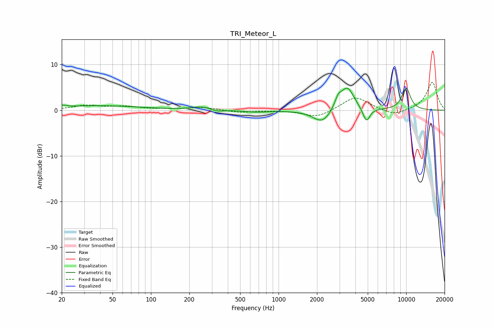

# TRI_Meteor_L
See [usage instructions](https://github.com/jaakkopasanen/AutoEq#usage) for more options and info.

### Parametric EQs
Apply preamp of -4.9 dB when using parametric equalizer.

|   # | Type    |   Fc (Hz) |    Q |   Gain (dB) |
|-----|---------|-----------|------|-------------|
|   1 | Peaking |        20 | 4.18 |         0.4 |
|   2 | Peaking |        39 | 0.44 |         1   |
|   3 | Peaking |       257 | 1.73 |         0.8 |
|   4 | Peaking |       326 | 2.85 |        -0.6 |
|   5 | Peaking |       663 | 1.4  |        -0.4 |
|   6 | Peaking |      2199 | 1.96 |        -2.9 |
|   7 | Peaking |      2934 | 5.14 |         2.1 |
|   8 | Peaking |      3463 | 2.68 |         5.1 |
|   9 | Peaking |      4877 | 5.07 |        -3.2 |
|  10 | Peaking |     10000 | 3.47 |         4.8 |

### Fixed Band EQs
When using fixed band (also called graphic) equalizer, apply preamp of **-6.2 dB** (if available) and set gains manually with these parameters.

|   # | Type    |   Fc (Hz) |    Q |   Gain (dB) |
|-----|---------|-----------|------|-------------|
|   1 | Peaking |        31 | 1.41 |         1   |
|   2 | Peaking |        62 | 1.41 |         0.7 |
|   3 | Peaking |       125 | 1.41 |         0.1 |
|   4 | Peaking |       250 | 1.41 |         0.7 |
|   5 | Peaking |       500 | 1.41 |        -0.5 |
|   6 | Peaking |      1000 | 1.41 |         0   |
|   7 | Peaking |      2000 | 1.41 |        -1.6 |
|   8 | Peaking |      4000 | 1.41 |         3   |
|   9 | Peaking |      8000 | 1.41 |        -1.3 |
|  10 | Peaking |     16000 | 1.41 |         6.2 |

### Graphs

