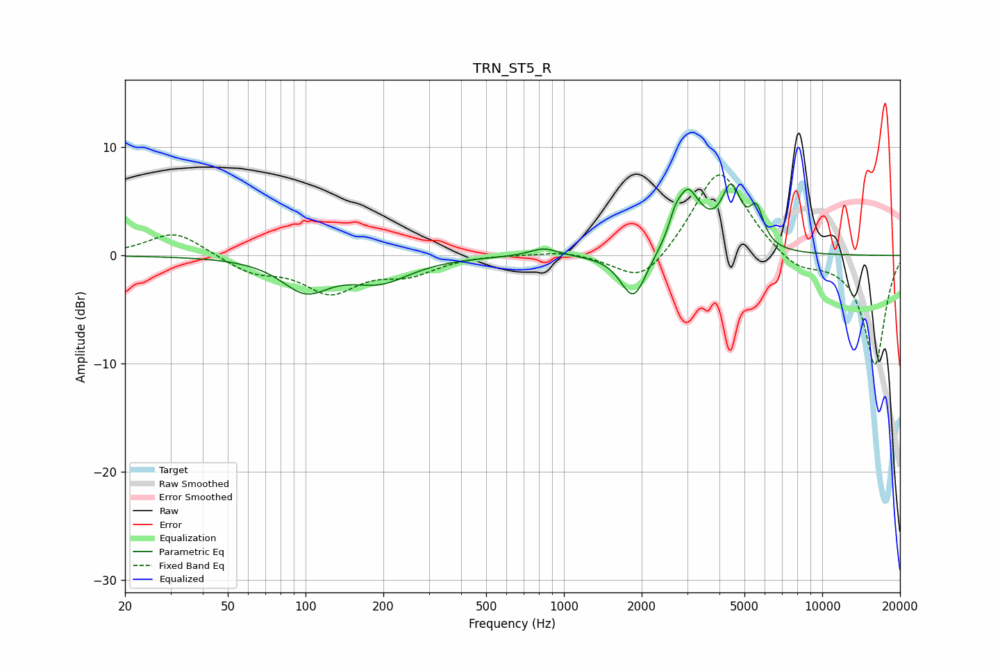

# TRN_ST5_R
See [usage instructions](https://github.com/jaakkopasanen/AutoEq#usage) for more options and info.

### Parametric EQs
Apply preamp of -6.7 dB when using parametric equalizer.

|   # | Type    |   Fc (Hz) |    Q |   Gain (dB) |
|-----|---------|-----------|------|-------------|
|   1 | Peaking |       100 | 1.53 |        -3   |
|   2 | Peaking |       194 | 1.19 |        -2.2 |
|   3 | Peaking |       836 | 2.53 |         0.8 |
|   4 | Peaking |      1860 | 2.86 |        -4.3 |
|   5 | Peaking |      2698 | 5.95 |         1.3 |
|   6 | Peaking |      3070 | 2.93 |         6.5 |
|   7 | Peaking |      3145 | 4.61 |        -0.6 |
|   8 | Peaking |      3211 | 5.21 |        -0.6 |
|   9 | Peaking |      4442 | 3.63 |         5.3 |
|  10 | Peaking |      5568 | 5.11 |         3.2 |

### Fixed Band EQs
When using fixed band (also called graphic) equalizer, apply preamp of **-7.5 dB** (if available) and set gains manually with these parameters.

|   # | Type    |   Fc (Hz) |    Q |   Gain (dB) |
|-----|---------|-----------|------|-------------|
|   1 | Peaking |        31 | 1.41 |         2.3 |
|   2 | Peaking |        62 | 1.41 |        -1.4 |
|   3 | Peaking |       125 | 1.41 |        -3.2 |
|   4 | Peaking |       250 | 1.41 |        -1.5 |
|   5 | Peaking |       500 | 1.41 |         0.1 |
|   6 | Peaking |      1000 | 1.41 |         0.5 |
|   7 | Peaking |      2000 | 1.41 |        -3   |
|   8 | Peaking |      4000 | 1.41 |         8.3 |
|   9 | Peaking |      8000 | 1.41 |        -1.5 |
|  10 | Peaking |     16000 | 1.41 |       -10.1 |

### Graphs

