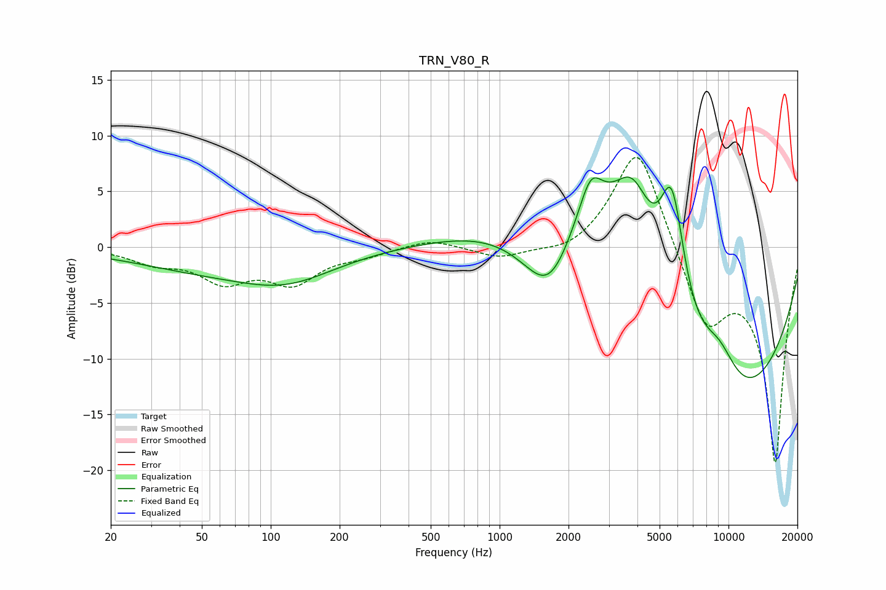

# TRN_V80_R
See [usage instructions](https://github.com/jaakkopasanen/AutoEq#usage) for more options and info.

### Parametric EQs
Apply preamp of -6.4 dB when using parametric equalizer.

|   # | Type    |   Fc (Hz) |    Q |   Gain (dB) |
|-----|---------|-----------|------|-------------|
|   1 | Peaking |        52 | 0.43 |        -1.8 |
|   2 | Peaking |       119 | 0.68 |        -2.3 |
|   3 | Peaking |      1663 | 1.01 |       -10.1 |
|   4 | Peaking |      2378 | 0.51 |        12.4 |
|   5 | Peaking |      2505 | 2.9  |         3.3 |
|   6 | Peaking |      3810 | 1.7  |         6.2 |
|   7 | Peaking |      5630 | 2.61 |         5.2 |
|   8 | Peaking |      5698 | 2.68 |         5   |
|   9 | Peaking |      9112 | 1.54 |         3.7 |
|  10 | Peaking |      9455 | 0.3  |       -15.7 |

### Fixed Band EQs
When using fixed band (also called graphic) equalizer, apply preamp of **-8.1 dB** (if available) and set gains manually with these parameters.

|   # | Type    |   Fc (Hz) |    Q |   Gain (dB) |
|-----|---------|-----------|------|-------------|
|   1 | Peaking |        31 | 1.41 |        -1.2 |
|   2 | Peaking |        62 | 1.41 |        -2.8 |
|   3 | Peaking |       125 | 1.41 |        -2.9 |
|   4 | Peaking |       250 | 1.41 |        -0.6 |
|   5 | Peaking |       500 | 1.41 |         0.8 |
|   6 | Peaking |      1000 | 1.41 |        -1   |
|   7 | Peaking |      2000 | 1.41 |        -0.8 |
|   8 | Peaking |      4000 | 1.41 |         9.6 |
|   9 | Peaking |      8000 | 1.41 |        -6.7 |
|  10 | Peaking |     16000 | 1.41 |       -19.3 |

### Graphs

