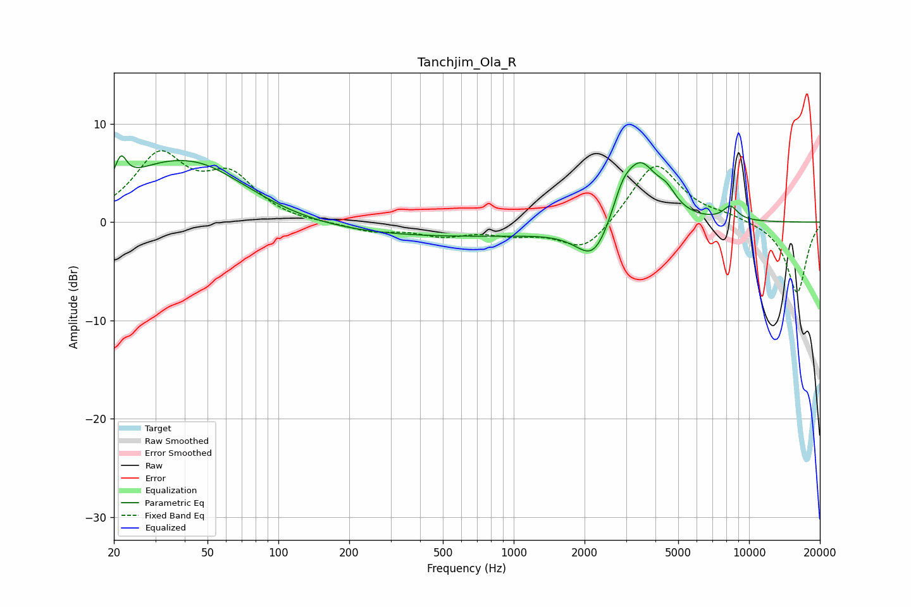

# Tanchjim_Ola_R
See [usage instructions](https://github.com/jaakkopasanen/AutoEq#usage) for more options and info.

### Parametric EQs
Apply preamp of -6.9 dB when using parametric equalizer.

|   # | Type    |   Fc (Hz) |    Q |   Gain (dB) |
|-----|---------|-----------|------|-------------|
|   1 | Peaking |        21 | 6    |         2.5 |
|   2 | Peaking |        39 | 1.31 |        -0.6 |
|   3 | Peaking |        40 | 0.58 |         7.1 |
|   4 | Peaking |       438 | 0.18 |        -1.5 |
|   5 | Peaking |      2196 | 1.89 |        -4.2 |
|   6 | Peaking |      2326 | 1.17 |         0.4 |
|   7 | Peaking |      2897 | 3.2  |         2.4 |
|   8 | Peaking |      3461 | 1.95 |         5.9 |
|   9 | Peaking |      4456 | 3.29 |         1.6 |
|  10 | Peaking |      8333 | 4.18 |         1.4 |

### Fixed Band EQs
When using fixed band (also called graphic) equalizer, apply preamp of **-7.4 dB** (if available) and set gains manually with these parameters.

|   # | Type    |   Fc (Hz) |    Q |   Gain (dB) |
|-----|---------|-----------|------|-------------|
|   1 | Peaking |        31 | 1.41 |         6.5 |
|   2 | Peaking |        62 | 1.41 |         4.2 |
|   3 | Peaking |       125 | 1.41 |        -0.2 |
|   4 | Peaking |       250 | 1.41 |        -0.9 |
|   5 | Peaking |       500 | 1.41 |        -1.2 |
|   6 | Peaking |      1000 | 1.41 |        -1   |
|   7 | Peaking |      2000 | 1.41 |        -3.1 |
|   8 | Peaking |      4000 | 1.41 |         6.3 |
|   9 | Peaking |      8000 | 1.41 |         0.5 |
|  10 | Peaking |     16000 | 1.41 |        -7.2 |

### Graphs

