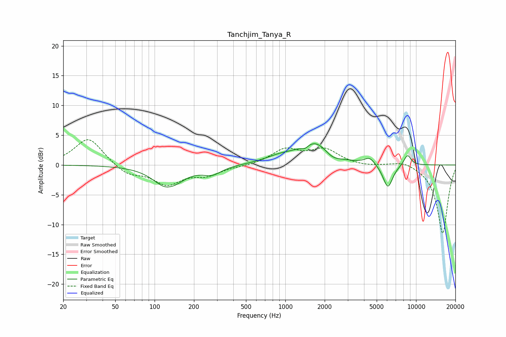

# Tanchjim_Tanya_R
See [usage instructions](https://github.com/jaakkopasanen/AutoEq#usage) for more options and info.

### Parametric EQs
Apply preamp of -3.7 dB when using parametric equalizer.

|   # | Type    |   Fc (Hz) |    Q |   Gain (dB) |
|-----|---------|-----------|------|-------------|
|   1 | Peaking |       127 | 1.37 |        -3.9 |
|   2 | Peaking |       130 | 3.39 |         0.3 |
|   3 | Peaking |       275 | 2    |        -1.3 |
|   4 | Peaking |       901 | 1.21 |         1   |
|   5 | Peaking |      1413 | 5.14 |        -0.7 |
|   6 | Peaking |      1692 | 1.18 |         3.8 |
|   7 | Peaking |      2277 | 2.22 |        -1.2 |
|   8 | Peaking |      4419 | 3.51 |         1.2 |
|   9 | Peaking |      6090 | 3.61 |        -4   |
|  10 | Peaking |      8597 | 4.58 |         1.8 |

### Fixed Band EQs
When using fixed band (also called graphic) equalizer, apply preamp of **-4.3 dB** (if available) and set gains manually with these parameters.

|   # | Type    |   Fc (Hz) |    Q |   Gain (dB) |
|-----|---------|-----------|------|-------------|
|   1 | Peaking |        31 | 1.41 |         4.6 |
|   2 | Peaking |        62 | 1.41 |        -1.7 |
|   3 | Peaking |       125 | 1.41 |        -3.1 |
|   4 | Peaking |       250 | 1.41 |        -1.5 |
|   5 | Peaking |       500 | 1.41 |        -0.2 |
|   6 | Peaking |      1000 | 1.41 |         2.5 |
|   7 | Peaking |      2000 | 1.41 |         2.5 |
|   8 | Peaking |      4000 | 1.41 |        -0.3 |
|   9 | Peaking |      8000 | 1.41 |         0.8 |
|  10 | Peaking |     16000 | 1.41 |       -11.5 |

### Graphs

