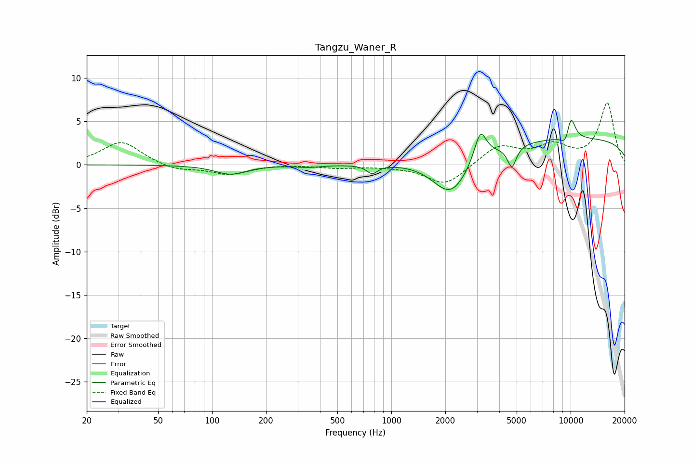

# Tangzu_Waner_R
See [usage instructions](https://github.com/jaakkopasanen/AutoEq#usage) for more options and info.

### Parametric EQs
Apply preamp of -5.2 dB when using parametric equalizer.

|   # | Type    |   Fc (Hz) |    Q |   Gain (dB) |
|-----|---------|-----------|------|-------------|
|   1 | Peaking |       126 | 1.65 |        -1.1 |
|   2 | Peaking |       345 | 2.11 |        -0.2 |
|   3 | Peaking |       782 | 4.74 |        -1   |
|   4 | Peaking |      2090 | 1.48 |        -1.1 |
|   5 | Peaking |      2174 | 1.4  |        -3.5 |
|   6 | Peaking |      3138 | 4.2  |         3.5 |
|   7 | Peaking |      4705 | 5.7  |        -2.5 |
|   8 | Peaking |      9436 | 4.86 |        -1.6 |
|   9 | Peaking |     10000 | 4.79 |         3.1 |
|  10 | Peaking |     10000 | 0.18 |         3.1 |

### Fixed Band EQs
When using fixed band (also called graphic) equalizer, apply preamp of **-7.2 dB** (if available) and set gains manually with these parameters.

|   # | Type    |   Fc (Hz) |    Q |   Gain (dB) |
|-----|---------|-----------|------|-------------|
|   1 | Peaking |        31 | 1.41 |         2.7 |
|   2 | Peaking |        62 | 1.41 |        -0.7 |
|   3 | Peaking |       125 | 1.41 |        -1.1 |
|   4 | Peaking |       250 | 1.41 |         0.1 |
|   5 | Peaking |       500 | 1.41 |        -0.3 |
|   6 | Peaking |      1000 | 1.41 |        -0.1 |
|   7 | Peaking |      2000 | 1.41 |        -2.4 |
|   8 | Peaking |      4000 | 1.41 |         2.2 |
|   9 | Peaking |      8000 | 1.41 |         2   |
|  10 | Peaking |     16000 | 1.41 |         7.1 |

### Graphs

