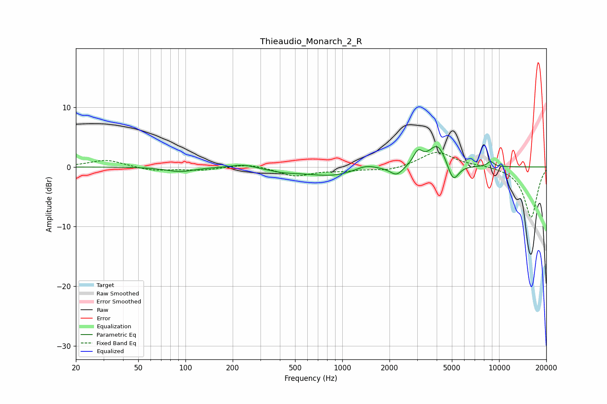

# Thieaudio_Monarch_2_R
See [usage instructions](https://github.com/jaakkopasanen/AutoEq#usage) for more options and info.

### Parametric EQs
Apply preamp of -3.5 dB when using parametric equalizer.

|   # | Type    |   Fc (Hz) |    Q |   Gain (dB) |
|-----|---------|-----------|------|-------------|
|   1 | Peaking |        92 | 1.62 |        -0.8 |
|   2 | Peaking |       234 | 1.87 |         0.6 |
|   3 | Peaking |       422 | 1.33 |        -0.6 |
|   4 | Peaking |       863 | 0.85 |        -1.4 |
|   5 | Peaking |      1411 | 2.05 |         0.9 |
|   6 | Peaking |      2221 | 3.47 |        -1.5 |
|   7 | Peaking |      3038 | 4.79 |         2.2 |
|   8 | Peaking |      4054 | 2.55 |         3.9 |
|   9 | Peaking |      5091 | 3.9  |        -3.3 |
|  10 | Peaking |      8828 | 6    |         0.9 |

### Fixed Band EQs
When using fixed band (also called graphic) equalizer, apply preamp of **-2.5 dB** (if available) and set gains manually with these parameters.

|   # | Type    |   Fc (Hz) |    Q |   Gain (dB) |
|-----|---------|-----------|------|-------------|
|   1 | Peaking |        31 | 1.41 |         1.2 |
|   2 | Peaking |        62 | 1.41 |        -0.6 |
|   3 | Peaking |       125 | 1.41 |        -0.5 |
|   4 | Peaking |       250 | 1.41 |         0.6 |
|   5 | Peaking |       500 | 1.41 |        -1.5 |
|   6 | Peaking |      1000 | 1.41 |        -0.5 |
|   7 | Peaking |      2000 | 1.41 |        -0.7 |
|   8 | Peaking |      4000 | 1.41 |         2.6 |
|   9 | Peaking |      8000 | 1.41 |         0.2 |
|  10 | Peaking |     16000 | 1.41 |        -8.5 |

### Graphs

