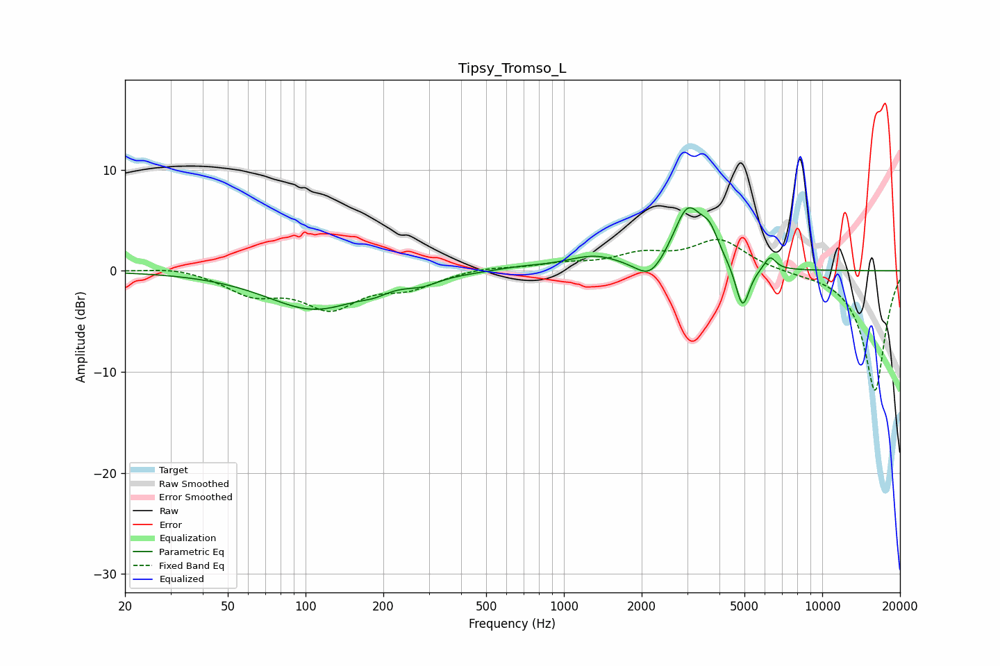

# Tipsy_Tromso_L
See [usage instructions](https://github.com/jaakkopasanen/AutoEq#usage) for more options and info.

### Parametric EQs
Apply preamp of -6.3 dB when using parametric equalizer.

|   # | Type    |   Fc (Hz) |    Q |   Gain (dB) |
|-----|---------|-----------|------|-------------|
|   1 | Peaking |       108 | 0.77 |        -3.7 |
|   2 | Peaking |       184 | 2.85 |        -0.5 |
|   3 | Peaking |       284 | 2.32 |        -0.7 |
|   4 | Peaking |       686 | 1.36 |         0.3 |
|   5 | Peaking |      1311 | 1.31 |         1.4 |
|   6 | Peaking |      2159 | 2.56 |        -2   |
|   7 | Peaking |      3017 | 2.46 |         6   |
|   8 | Peaking |      3669 | 4.01 |         2.3 |
|   9 | Peaking |      4915 | 5.21 |        -4.4 |
|  10 | Peaking |      6280 | 6    |         1.4 |

### Fixed Band EQs
When using fixed band (also called graphic) equalizer, apply preamp of **-3.2 dB** (if available) and set gains manually with these parameters.

|   # | Type    |   Fc (Hz) |    Q |   Gain (dB) |
|-----|---------|-----------|------|-------------|
|   1 | Peaking |        31 | 1.41 |         0.5 |
|   2 | Peaking |        62 | 1.41 |        -2.1 |
|   3 | Peaking |       125 | 1.41 |        -3.4 |
|   4 | Peaking |       250 | 1.41 |        -1.5 |
|   5 | Peaking |       500 | 1.41 |         0.4 |
|   6 | Peaking |      1000 | 1.41 |         0.6 |
|   7 | Peaking |      2000 | 1.41 |         1.4 |
|   8 | Peaking |      4000 | 1.41 |         3   |
|   9 | Peaking |      8000 | 1.41 |        -0.2 |
|  10 | Peaking |     16000 | 1.41 |       -11.9 |

### Graphs

