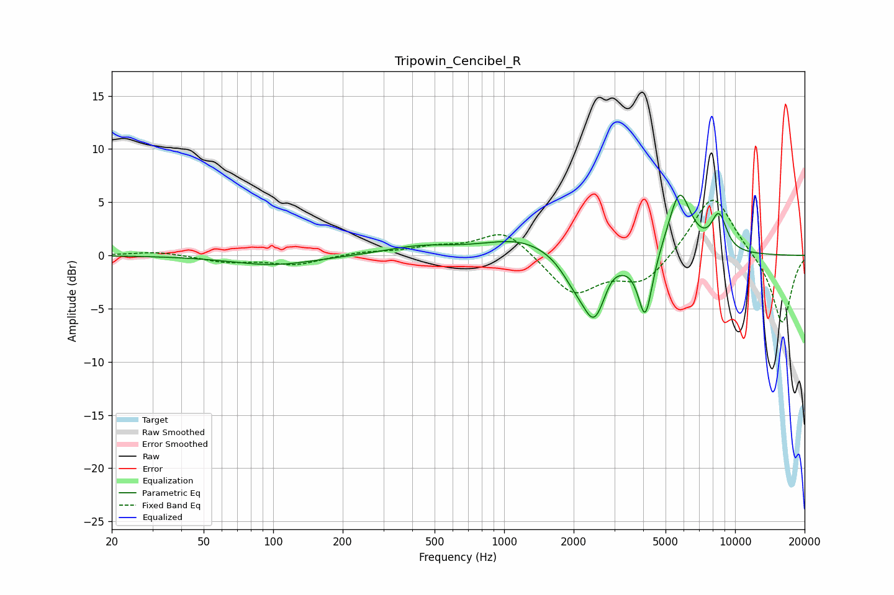

# Tripowin_Cencibel_R
See [usage instructions](https://github.com/jaakkopasanen/AutoEq#usage) for more options and info.

### Parametric EQs
Apply preamp of -5.8 dB when using parametric equalizer.

|   # | Type    |   Fc (Hz) |    Q |   Gain (dB) |
|-----|---------|-----------|------|-------------|
|   1 | Peaking |       100 | 0.78 |        -0.9 |
|   2 | Peaking |       432 | 0.94 |         0.8 |
|   3 | Peaking |      1186 | 0.88 |         1.6 |
|   4 | Peaking |      2001 | 2.39 |        -1.7 |
|   5 | Peaking |      2457 | 2.62 |        -5.7 |
|   6 | Peaking |      2907 | 3.87 |         0.7 |
|   7 | Peaking |      4086 | 4.53 |        -6.1 |
|   8 | Peaking |      5751 | 2.75 |         6.1 |
|   9 | Peaking |      8438 | 4.14 |         2.8 |
|  10 | Peaking |      8869 | 4.68 |         0.7 |

### Fixed Band EQs
When using fixed band (also called graphic) equalizer, apply preamp of **-5.3 dB** (if available) and set gains manually with these parameters.

|   # | Type    |   Fc (Hz) |    Q |   Gain (dB) |
|-----|---------|-----------|------|-------------|
|   1 | Peaking |        31 | 1.41 |         0.4 |
|   2 | Peaking |        62 | 1.41 |        -0.6 |
|   3 | Peaking |       125 | 1.41 |        -0.9 |
|   4 | Peaking |       250 | 1.41 |         0.3 |
|   5 | Peaking |       500 | 1.41 |         0.7 |
|   6 | Peaking |      1000 | 1.41 |         2.5 |
|   7 | Peaking |      2000 | 1.41 |        -3.7 |
|   8 | Peaking |      4000 | 1.41 |        -2.6 |
|   9 | Peaking |      8000 | 1.41 |         6   |
|  10 | Peaking |     16000 | 1.41 |        -6.6 |

### Graphs

