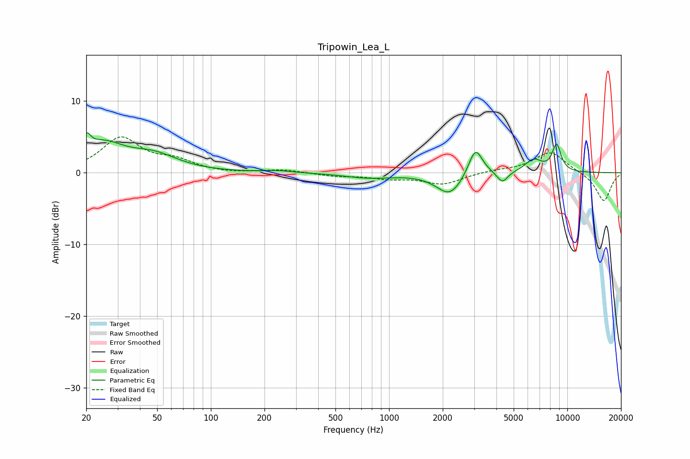

# Tripowin_Lea_L
See [usage instructions](https://github.com/jaakkopasanen/AutoEq#usage) for more options and info.

### Parametric EQs
Apply preamp of -5.7 dB when using parametric equalizer.

|   # | Type    |   Fc (Hz) |    Q |   Gain (dB) |
|-----|---------|-----------|------|-------------|
|   1 | Peaking |        20 | 6    |         2.2 |
|   2 | Peaking |        25 | 1.17 |         3.6 |
|   3 | Peaking |        48 | 1.05 |         2.1 |
|   4 | Peaking |       238 | 1.84 |         0.3 |
|   5 | Peaking |       768 | 1.06 |        -0.7 |
|   6 | Peaking |      2189 | 1.92 |        -3.1 |
|   7 | Peaking |      3051 | 3.56 |         4   |
|   8 | Peaking |      4322 | 4.67 |        -1.6 |
|   9 | Peaking |      6467 | 2.81 |         1.8 |
|  10 | Peaking |      8705 | 5.14 |         3.7 |

### Fixed Band EQs
When using fixed band (also called graphic) equalizer, apply preamp of **-5.1 dB** (if available) and set gains manually with these parameters.

|   # | Type    |   Fc (Hz) |    Q |   Gain (dB) |
|-----|---------|-----------|------|-------------|
|   1 | Peaking |        31 | 1.41 |         4.7 |
|   2 | Peaking |        62 | 1.41 |         1.5 |
|   3 | Peaking |       125 | 1.41 |        -0.1 |
|   4 | Peaking |       250 | 1.41 |         0.4 |
|   5 | Peaking |       500 | 1.41 |        -0.4 |
|   6 | Peaking |      1000 | 1.41 |        -0.7 |
|   7 | Peaking |      2000 | 1.41 |        -1.5 |
|   8 | Peaking |      4000 | 1.41 |         0.3 |
|   9 | Peaking |      8000 | 1.41 |         3   |
|  10 | Peaking |     16000 | 1.41 |        -4   |

### Graphs

