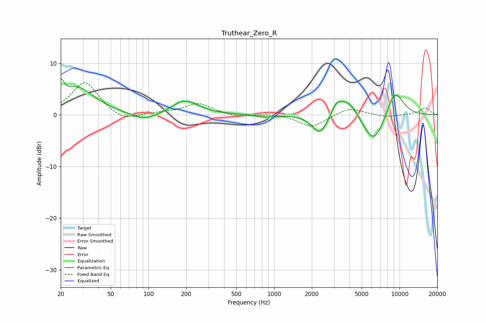

# Truthear_Zero_R
See [usage instructions](https://github.com/jaakkopasanen/AutoEq#usage) for more options and info.

### Parametric EQs
Apply preamp of -7.1 dB when using parametric equalizer.

|   # | Type    |   Fc (Hz) |    Q |   Gain (dB) |
|-----|---------|-----------|------|-------------|
|   1 | Peaking |        20 | 5.98 |         3.2 |
|   2 | Peaking |        27 | 1.02 |         5.3 |
|   3 | Peaking |        94 | 1.34 |        -1.5 |
|   4 | Peaking |       195 | 1.35 |         2.8 |
|   5 | Peaking |       852 | 2.34 |        -0.4 |
|   6 | Peaking |      2317 | 2.41 |        -3.8 |
|   7 | Peaking |      3154 | 4.3  |         1.8 |
|   8 | Peaking |      3877 | 1.7  |         3.9 |
|   9 | Peaking |      6223 | 1.5  |        -6.3 |
|  10 | Peaking |      9151 | 1.78 |         5.6 |

### Fixed Band EQs
When using fixed band (also called graphic) equalizer, apply preamp of **-6.3 dB** (if available) and set gains manually with these parameters.

|   # | Type    |   Fc (Hz) |    Q |   Gain (dB) |
|-----|---------|-----------|------|-------------|
|   1 | Peaking |        31 | 1.41 |         6.5 |
|   2 | Peaking |        62 | 1.41 |        -1.5 |
|   3 | Peaking |       125 | 1.41 |         0.3 |
|   4 | Peaking |       250 | 1.41 |         2.2 |
|   5 | Peaking |       500 | 1.41 |        -0.5 |
|   6 | Peaking |      1000 | 1.41 |         0.3 |
|   7 | Peaking |      2000 | 1.41 |        -2.4 |
|   8 | Peaking |      4000 | 1.41 |         1.5 |
|   9 | Peaking |      8000 | 1.41 |        -0.5 |
|  10 | Peaking |     16000 | 1.41 |         1.4 |

### Graphs

