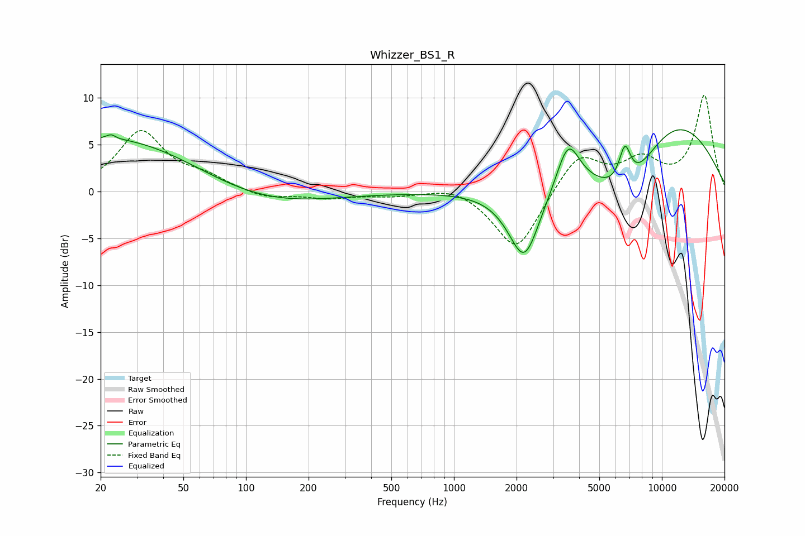

# Whizzer_BS1_R
See [usage instructions](https://github.com/jaakkopasanen/AutoEq#usage) for more options and info.

### Parametric EQs
Apply preamp of -6.7 dB when using parametric equalizer.

|   # | Type    |   Fc (Hz) |    Q |   Gain (dB) |
|-----|---------|-----------|------|-------------|
|   1 | Peaking |        21 | 0.23 |         1   |
|   2 | Peaking |        23 | 5.44 |         3.1 |
|   3 | Peaking |        23 | 5.45 |        -2.7 |
|   4 | Peaking |        24 | 0.34 |         5   |
|   5 | Peaking |       106 | 0.44 |        -2.1 |
|   6 | Peaking |      2180 | 1.82 |        -8   |
|   7 | Peaking |      3542 | 2.53 |         5.1 |
|   8 | Peaking |      6642 | 4.6  |         4.1 |
|   9 | Peaking |      6814 | 0.84 |        -7.2 |
|  10 | Peaking |     10000 | 0.4  |         9.5 |

### Fixed Band EQs
When using fixed band (also called graphic) equalizer, apply preamp of **-10.4 dB** (if available) and set gains manually with these parameters.

|   # | Type    |   Fc (Hz) |    Q |   Gain (dB) |
|-----|---------|-----------|------|-------------|
|   1 | Peaking |        31 | 1.41 |         6.3 |
|   2 | Peaking |        62 | 1.41 |         1.3 |
|   3 | Peaking |       125 | 1.41 |        -0.8 |
|   4 | Peaking |       250 | 1.41 |        -0.7 |
|   5 | Peaking |       500 | 1.41 |        -0.4 |
|   6 | Peaking |      1000 | 1.41 |         0.8 |
|   7 | Peaking |      2000 | 1.41 |        -6.5 |
|   8 | Peaking |      4000 | 1.41 |         4.1 |
|   9 | Peaking |      8000 | 1.41 |         3   |
|  10 | Peaking |     16000 | 1.41 |        10.2 |

### Graphs

