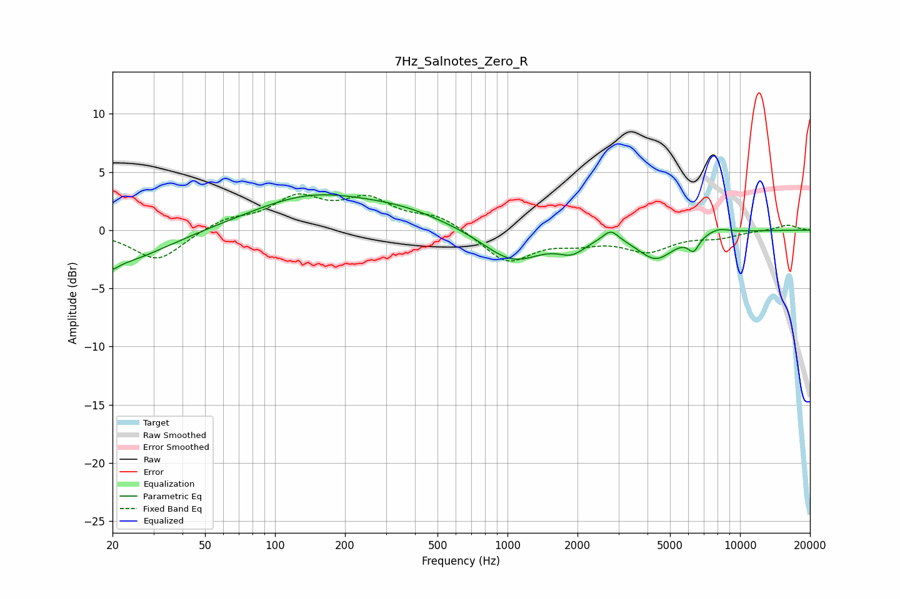

# 7Hz_Salnotes_Zero_R
See [usage instructions](https://github.com/jaakkopasanen/AutoEq#usage) for more options and info.

### Parametric EQs
Apply preamp of -3.1 dB when using parametric equalizer.

|   # | Type    |   Fc (Hz) |    Q |   Gain (dB) |
|-----|---------|-----------|------|-------------|
|   1 | Peaking |        20 | 5.84 |        -0.5 |
|   2 | Peaking |        20 | 0.66 |        -3   |
|   3 | Peaking |       143 | 0.54 |         2.8 |
|   4 | Peaking |       360 | 0.72 |         1.1 |
|   5 | Peaking |      1053 | 1.11 |        -2.7 |
|   6 | Peaking |      1895 | 2.39 |        -1.2 |
|   7 | Peaking |      2780 | 4.24 |         1   |
|   8 | Peaking |      4344 | 1.8  |        -2.3 |
|   9 | Peaking |      6315 | 5.8  |        -1.2 |
|  10 | Peaking |      8034 | 2.81 |         0.4 |

### Fixed Band EQs
When using fixed band (also called graphic) equalizer, apply preamp of **-3.2 dB** (if available) and set gains manually with these parameters.

|   # | Type    |   Fc (Hz) |    Q |   Gain (dB) |
|-----|---------|-----------|------|-------------|
|   1 | Peaking |        31 | 1.41 |        -2.7 |
|   2 | Peaking |        62 | 1.41 |         0.9 |
|   3 | Peaking |       125 | 1.41 |         2.6 |
|   4 | Peaking |       250 | 1.41 |         2.4 |
|   5 | Peaking |       500 | 1.41 |         1.2 |
|   6 | Peaking |      1000 | 1.41 |        -2.7 |
|   7 | Peaking |      2000 | 1.41 |        -0.8 |
|   8 | Peaking |      4000 | 1.41 |        -1.7 |
|   9 | Peaking |      8000 | 1.41 |        -0.5 |
|  10 | Peaking |     16000 | 1.41 |         0.5 |

### Graphs

