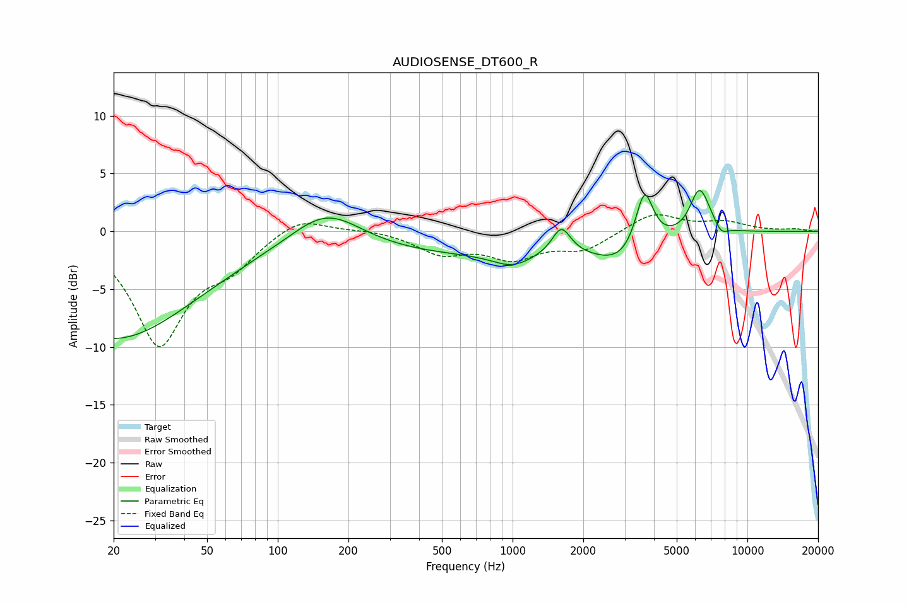

# AUDIOSENSE_DT600_R
See [usage instructions](https://github.com/jaakkopasanen/AutoEq#usage) for more options and info.

### Parametric EQs
Apply preamp of -3.6 dB when using parametric equalizer.

|   # | Type    |   Fc (Hz) |    Q |   Gain (dB) |
|-----|---------|-----------|------|-------------|
|   1 | Peaking |        20 | 0.4  |        -9.3 |
|   2 | Peaking |       161 | 0.94 |         3.4 |
|   3 | Peaking |       591 | 0.23 |        -2   |
|   4 | Peaking |       999 | 1.69 |        -1.1 |
|   5 | Peaking |      1614 | 3.59 |         2.4 |
|   6 | Peaking |      2938 | 1.25 |        -2.1 |
|   7 | Peaking |      3640 | 3.69 |         5.1 |
|   8 | Peaking |      6232 | 3.44 |         3.6 |
|   9 | Peaking |      6868 | 3.18 |         0.6 |
|  10 | Peaking |      7703 | 4.7  |        -0.8 |

### Fixed Band EQs
When using fixed band (also called graphic) equalizer, apply preamp of **-1.5 dB** (if available) and set gains manually with these parameters.

|   # | Type    |   Fc (Hz) |    Q |   Gain (dB) |
|-----|---------|-----------|------|-------------|
|   1 | Peaking |        31 | 1.41 |        -9.6 |
|   2 | Peaking |        62 | 1.41 |        -2.4 |
|   3 | Peaking |       125 | 1.41 |         1.5 |
|   4 | Peaking |       250 | 1.41 |         0.2 |
|   5 | Peaking |       500 | 1.41 |        -1.8 |
|   6 | Peaking |      1000 | 1.41 |        -2.1 |
|   7 | Peaking |      2000 | 1.41 |        -1.5 |
|   8 | Peaking |      4000 | 1.41 |         1.6 |
|   9 | Peaking |      8000 | 1.41 |         0.7 |
|  10 | Peaking |     16000 | 1.41 |         0.2 |

### Graphs

