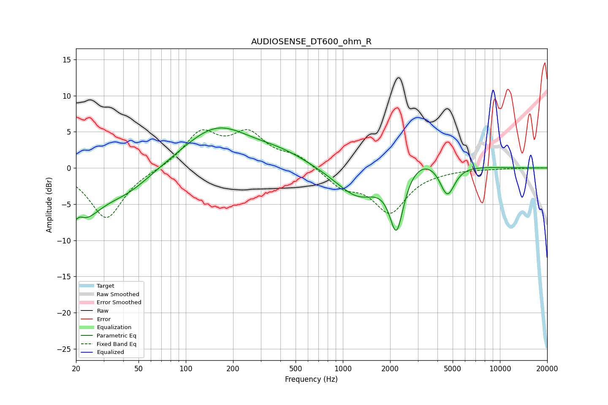

# AUDIOSENSE_DT600_ohm_R
See [usage instructions](https://github.com/jaakkopasanen/AutoEq#usage) for more options and info.

### Parametric EQs
Apply preamp of -5.6 dB when using parametric equalizer.

|   # | Type    |   Fc (Hz) |    Q |   Gain (dB) |
|-----|---------|-----------|------|-------------|
|   1 | Peaking |        20 | 4.93 |        -4.4 |
|   2 | Peaking |        21 | 5.3  |         3.5 |
|   3 | Peaking |        22 | 1.27 |        -5.4 |
|   4 | Peaking |        41 | 0.81 |        -3.1 |
|   5 | Peaking |       158 | 0.65 |         5.6 |
|   6 | Peaking |       412 | 0.8  |         1.4 |
|   7 | Peaking |      1259 | 0.99 |        -4.3 |
|   8 | Peaking |      2197 | 3.07 |        -8.7 |
|   9 | Peaking |      3091 | 0.83 |         2.6 |
|  10 | Peaking |      4623 | 2.87 |        -4.6 |

### Fixed Band EQs
When using fixed band (also called graphic) equalizer, apply preamp of **-5.4 dB** (if available) and set gains manually with these parameters.

|   # | Type    |   Fc (Hz) |    Q |   Gain (dB) |
|-----|---------|-----------|------|-------------|
|   1 | Peaking |        31 | 1.41 |        -7   |
|   2 | Peaking |        62 | 1.41 |        -0.2 |
|   3 | Peaking |       125 | 1.41 |         4.7 |
|   4 | Peaking |       250 | 1.41 |         4.3 |
|   5 | Peaking |       500 | 1.41 |         1.6 |
|   6 | Peaking |      1000 | 1.41 |        -2.4 |
|   7 | Peaking |      2000 | 1.41 |        -5.9 |
|   8 | Peaking |      4000 | 1.41 |        -0.2 |
|   9 | Peaking |      8000 | 1.41 |        -0.1 |
|  10 | Peaking |     16000 | 1.41 |         0   |

### Graphs

