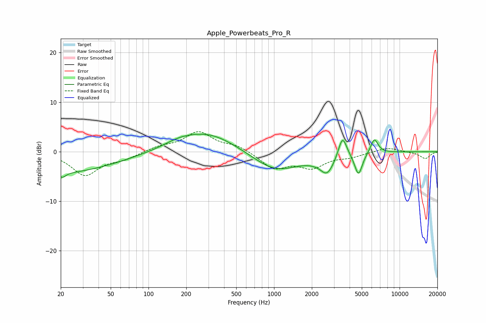

# Apple_Powerbeats_Pro_R
See [usage instructions](https://github.com/jaakkopasanen/AutoEq#usage) for more options and info.

### Parametric EQs
Apply preamp of -3.6 dB when using parametric equalizer.

|   # | Type    |   Fc (Hz) |    Q |   Gain (dB) |
|-----|---------|-----------|------|-------------|
|   1 | Peaking |        20 | 0.32 |        -4.2 |
|   2 | Peaking |        21 | 4.79 |        -1   |
|   3 | Peaking |       174 | 1.25 |         0.8 |
|   4 | Peaking |       295 | 0.61 |         3.9 |
|   5 | Peaking |      1030 | 0.76 |        -4   |
|   6 | Peaking |      2442 | 2.68 |         1.5 |
|   7 | Peaking |      2586 | 2.24 |        -5.2 |
|   8 | Peaking |      3508 | 4.09 |         4.7 |
|   9 | Peaking |      4704 | 4.53 |        -4.5 |
|  10 | Peaking |      6290 | 4.59 |         3   |

### Fixed Band EQs
When using fixed band (also called graphic) equalizer, apply preamp of **-4.1 dB** (if available) and set gains manually with these parameters.

|   # | Type    |   Fc (Hz) |    Q |   Gain (dB) |
|-----|---------|-----------|------|-------------|
|   1 | Peaking |        31 | 1.41 |        -4.7 |
|   2 | Peaking |        62 | 1.41 |        -1.3 |
|   3 | Peaking |       125 | 1.41 |         1   |
|   4 | Peaking |       250 | 1.41 |         3.9 |
|   5 | Peaking |       500 | 1.41 |         1.2 |
|   6 | Peaking |      1000 | 1.41 |        -3.2 |
|   7 | Peaking |      2000 | 1.41 |        -2.9 |
|   8 | Peaking |      4000 | 1.41 |        -0.9 |
|   9 | Peaking |      8000 | 1.41 |         0.9 |
|  10 | Peaking |     16000 | 1.41 |        -1.4 |

### Graphs

