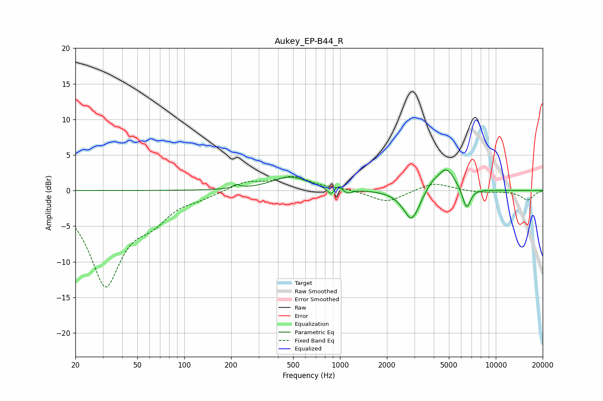

# Aukey_EP-B44_R
See [usage instructions](https://github.com/jaakkopasanen/AutoEq#usage) for more options and info.

### Parametric EQs
Apply preamp of -3.0 dB when using parametric equalizer.

|   # | Type    |   Fc (Hz) |    Q |   Gain (dB) |
|-----|---------|-----------|------|-------------|
|   1 | Peaking |       217 | 6    |         0.5 |
|   2 | Peaking |       479 | 1.22 |         1.9 |
|   3 | Peaking |       880 | 6    |        -1.2 |
|   4 | Peaking |       961 | 6    |         0.9 |
|   5 | Peaking |      1114 | 4.97 |        -0.6 |
|   6 | Peaking |      2643 | 2.07 |        -0.6 |
|   7 | Peaking |      2893 | 2.98 |        -3.8 |
|   8 | Peaking |      3882 | 3.77 |         0.8 |
|   9 | Peaking |      4804 | 2.44 |         3.3 |
|  10 | Peaking |      6488 | 5.27 |        -3   |

### Fixed Band EQs
When using fixed band (also called graphic) equalizer, apply preamp of **-2.1 dB** (if available) and set gains manually with these parameters.

|   # | Type    |   Fc (Hz) |    Q |   Gain (dB) |
|-----|---------|-----------|------|-------------|
|   1 | Peaking |        31 | 1.41 |       -13   |
|   2 | Peaking |        62 | 1.41 |        -2.8 |
|   3 | Peaking |       125 | 1.41 |        -0.7 |
|   4 | Peaking |       250 | 1.41 |         1.2 |
|   5 | Peaking |       500 | 1.41 |         1.9 |
|   6 | Peaking |      1000 | 1.41 |         0.2 |
|   7 | Peaking |      2000 | 1.41 |        -1.7 |
|   8 | Peaking |      4000 | 1.41 |         1.2 |
|   9 | Peaking |      8000 | 1.41 |        -0.3 |
|  10 | Peaking |     16000 | 1.41 |        -1.3 |

### Graphs

