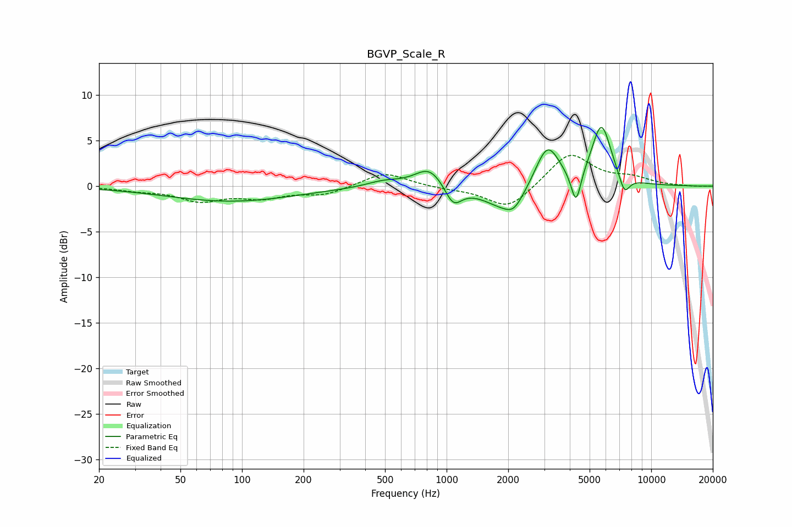

# BGVP_Scale_R
See [usage instructions](https://github.com/jaakkopasanen/AutoEq#usage) for more options and info.

### Parametric EQs
Apply preamp of -6.5 dB when using parametric equalizer.

|   # | Type    |   Fc (Hz) |    Q |   Gain (dB) |
|-----|---------|-----------|------|-------------|
|   1 | Peaking |        88 | 0.45 |        -1.7 |
|   2 | Peaking |       493 | 1.64 |         0.6 |
|   3 | Peaking |       826 | 1.99 |         2.2 |
|   4 | Peaking |      1078 | 3.44 |        -2.2 |
|   5 | Peaking |      1960 | 1.3  |        -2.7 |
|   6 | Peaking |      2133 | 3.48 |        -1.1 |
|   7 | Peaking |      3105 | 2.33 |         4.9 |
|   8 | Peaking |      4290 | 5.83 |        -3.8 |
|   9 | Peaking |      5711 | 2.83 |         6.7 |
|  10 | Peaking |      7391 | 5.13 |        -2.1 |

### Fixed Band EQs
When using fixed band (also called graphic) equalizer, apply preamp of **-3.5 dB** (if available) and set gains manually with these parameters.

|   # | Type    |   Fc (Hz) |    Q |   Gain (dB) |
|-----|---------|-----------|------|-------------|
|   1 | Peaking |        31 | 1.41 |        -0.4 |
|   2 | Peaking |        62 | 1.41 |        -1.5 |
|   3 | Peaking |       125 | 1.41 |        -1.1 |
|   4 | Peaking |       250 | 1.41 |        -0.9 |
|   5 | Peaking |       500 | 1.41 |         1.6 |
|   6 | Peaking |      1000 | 1.41 |        -0.2 |
|   7 | Peaking |      2000 | 1.41 |        -2.6 |
|   8 | Peaking |      4000 | 1.41 |         3.7 |
|   9 | Peaking |      8000 | 1.41 |         0.8 |
|  10 | Peaking |     16000 | 1.41 |        -0   |

### Graphs

