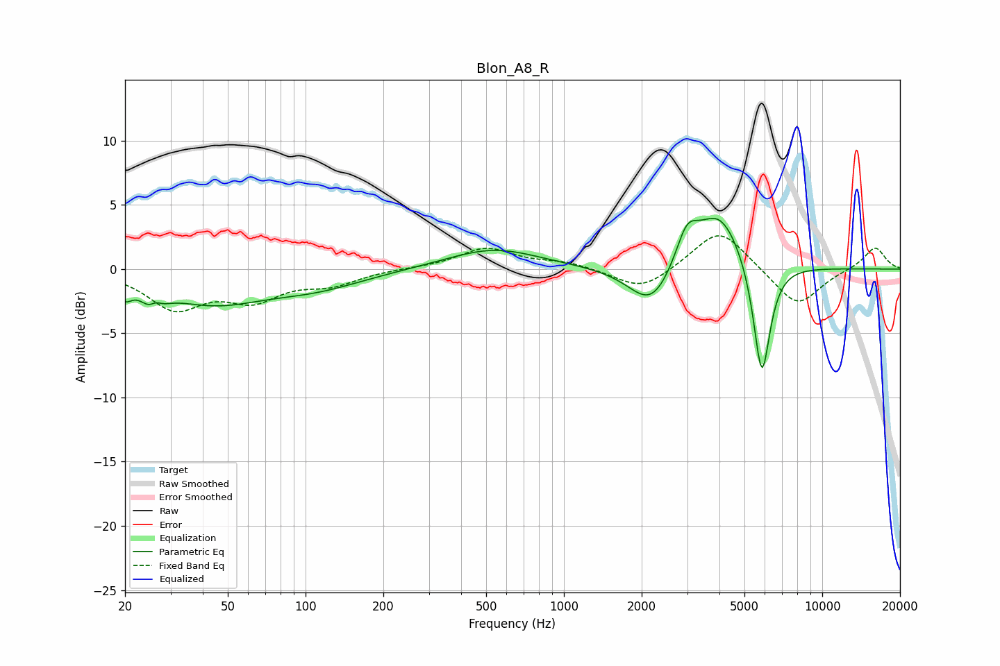

# Blon_A8_R
See [usage instructions](https://github.com/jaakkopasanen/AutoEq#usage) for more options and info.

### Parametric EQs
Apply preamp of -4.0 dB when using parametric equalizer.

|   # | Type    |   Fc (Hz) |    Q |   Gain (dB) |
|-----|---------|-----------|------|-------------|
|   1 | Peaking |        20 | 5.59 |        -1.1 |
|   2 | Peaking |        26 | 3.92 |        -2.8 |
|   3 | Peaking |        26 | 5.34 |         1.9 |
|   4 | Peaking |        44 | 0.7  |        -2.4 |
|   5 | Peaking |       110 | 0.75 |        -1.2 |
|   6 | Peaking |       533 | 0.79 |         1.6 |
|   7 | Peaking |      2187 | 1.62 |        -3.4 |
|   8 | Peaking |      2990 | 3.27 |         2.7 |
|   9 | Peaking |      3988 | 1.51 |         4.6 |
|  10 | Peaking |      5835 | 4.16 |        -9.4 |

### Fixed Band EQs
When using fixed band (also called graphic) equalizer, apply preamp of **-2.7 dB** (if available) and set gains manually with these parameters.

|   # | Type    |   Fc (Hz) |    Q |   Gain (dB) |
|-----|---------|-----------|------|-------------|
|   1 | Peaking |        31 | 1.41 |        -2.9 |
|   2 | Peaking |        62 | 1.41 |        -2.1 |
|   3 | Peaking |       125 | 1.41 |        -1.1 |
|   4 | Peaking |       250 | 1.41 |         0.1 |
|   5 | Peaking |       500 | 1.41 |         1.6 |
|   6 | Peaking |      1000 | 1.41 |         0.5 |
|   7 | Peaking |      2000 | 1.41 |        -1.7 |
|   8 | Peaking |      4000 | 1.41 |         3.3 |
|   9 | Peaking |      8000 | 1.41 |        -3   |
|  10 | Peaking |     16000 | 1.41 |         1.8 |

### Graphs

