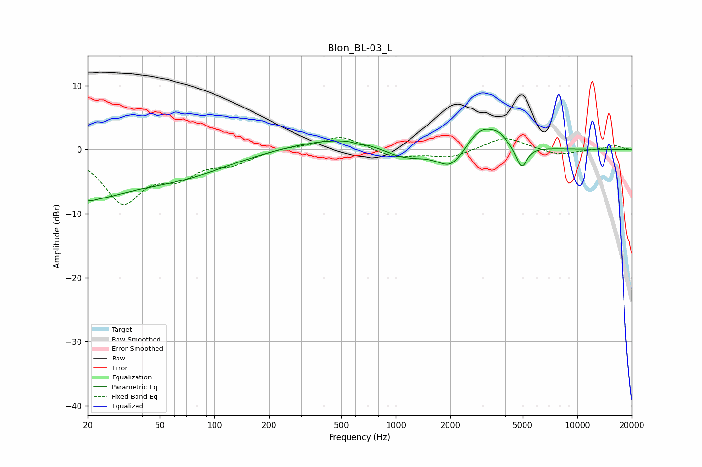

# Blon_BL-03_L
See [usage instructions](https://github.com/jaakkopasanen/AutoEq#usage) for more options and info.

### Parametric EQs
Apply preamp of -3.3 dB when using parametric equalizer.

|   # | Type    |   Fc (Hz) |    Q |   Gain (dB) |
|-----|---------|-----------|------|-------------|
|   1 | Peaking |        20 | 0.62 |        -6.2 |
|   2 | Peaking |        20 | 3.91 |        -0.6 |
|   3 | Peaking |        64 | 0.5  |        -3.5 |
|   4 | Peaking |       632 | 5.8  |        -0.3 |
|   5 | Peaking |       689 | 0.42 |         2.7 |
|   6 | Peaking |      1100 | 0.96 |        -3.1 |
|   7 | Peaking |      2023 | 1.84 |        -3.6 |
|   8 | Peaking |      2988 | 1.56 |         3.9 |
|   9 | Peaking |      3702 | 3.75 |         0.9 |
|  10 | Peaking |      4933 | 4.67 |        -3.6 |

### Fixed Band EQs
When using fixed band (also called graphic) equalizer, apply preamp of **-2.0 dB** (if available) and set gains manually with these parameters.

|   # | Type    |   Fc (Hz) |    Q |   Gain (dB) |
|-----|---------|-----------|------|-------------|
|   1 | Peaking |        31 | 1.41 |        -7.9 |
|   2 | Peaking |        62 | 1.41 |        -3.4 |
|   3 | Peaking |       125 | 1.41 |        -1.9 |
|   4 | Peaking |       250 | 1.41 |         0.4 |
|   5 | Peaking |       500 | 1.41 |         2.2 |
|   6 | Peaking |      1000 | 1.41 |        -1.3 |
|   7 | Peaking |      2000 | 1.41 |        -1.2 |
|   8 | Peaking |      4000 | 1.41 |         2.1 |
|   9 | Peaking |      8000 | 1.41 |        -0.9 |
|  10 | Peaking |     16000 | 1.41 |         0.6 |

### Graphs

