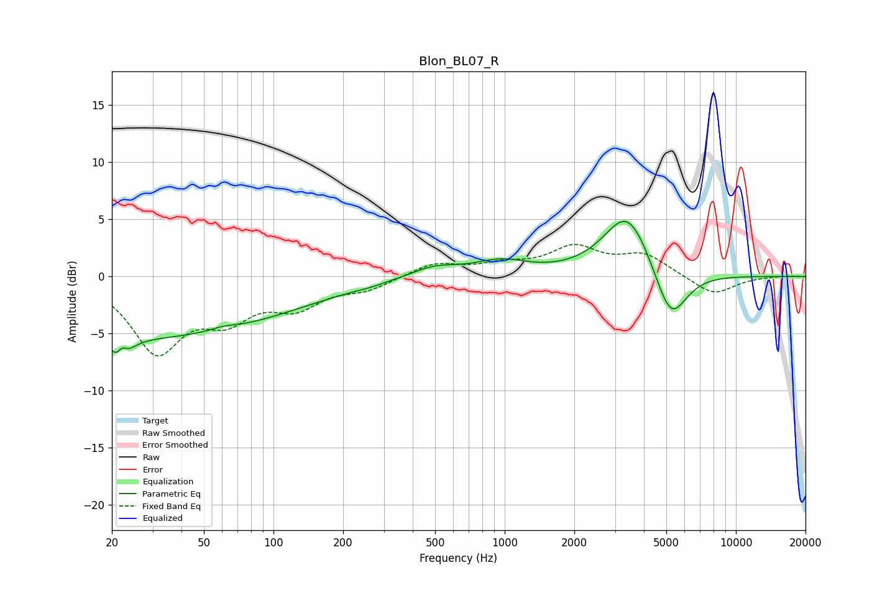

# Blon_BL07_R
See [usage instructions](https://github.com/jaakkopasanen/AutoEq#usage) for more options and info.

### Parametric EQs
Apply preamp of -4.9 dB when using parametric equalizer.

|   # | Type    |   Fc (Hz) |    Q |   Gain (dB) |
|-----|---------|-----------|------|-------------|
|   1 | Peaking |        22 | 4.33 |        -4.2 |
|   2 | Peaking |        22 | 5.92 |         3.2 |
|   3 | Peaking |        23 | 0.18 |        -4.6 |
|   4 | Peaking |        41 | 0.22 |        -0.7 |
|   5 | Peaking |        61 | 2.54 |         0.3 |
|   6 | Peaking |       262 | 2.14 |        -0.1 |
|   7 | Peaking |       493 | 1.3  |         0.9 |
|   8 | Peaking |       967 | 1.23 |         1.2 |
|   9 | Peaking |      3403 | 1.37 |         5.8 |
|  10 | Peaking |      5218 | 2    |        -4.9 |

### Fixed Band EQs
When using fixed band (also called graphic) equalizer, apply preamp of **-2.9 dB** (if available) and set gains manually with these parameters.

|   # | Type    |   Fc (Hz) |    Q |   Gain (dB) |
|-----|---------|-----------|------|-------------|
|   1 | Peaking |        31 | 1.41 |        -6.3 |
|   2 | Peaking |        62 | 1.41 |        -3   |
|   3 | Peaking |       125 | 1.41 |        -2.3 |
|   4 | Peaking |       250 | 1.41 |        -1   |
|   5 | Peaking |       500 | 1.41 |         1.1 |
|   6 | Peaking |      1000 | 1.41 |         0.8 |
|   7 | Peaking |      2000 | 1.41 |         2.4 |
|   8 | Peaking |      4000 | 1.41 |         1.8 |
|   9 | Peaking |      8000 | 1.41 |        -1.7 |
|  10 | Peaking |     16000 | 1.41 |         0.1 |

### Graphs

